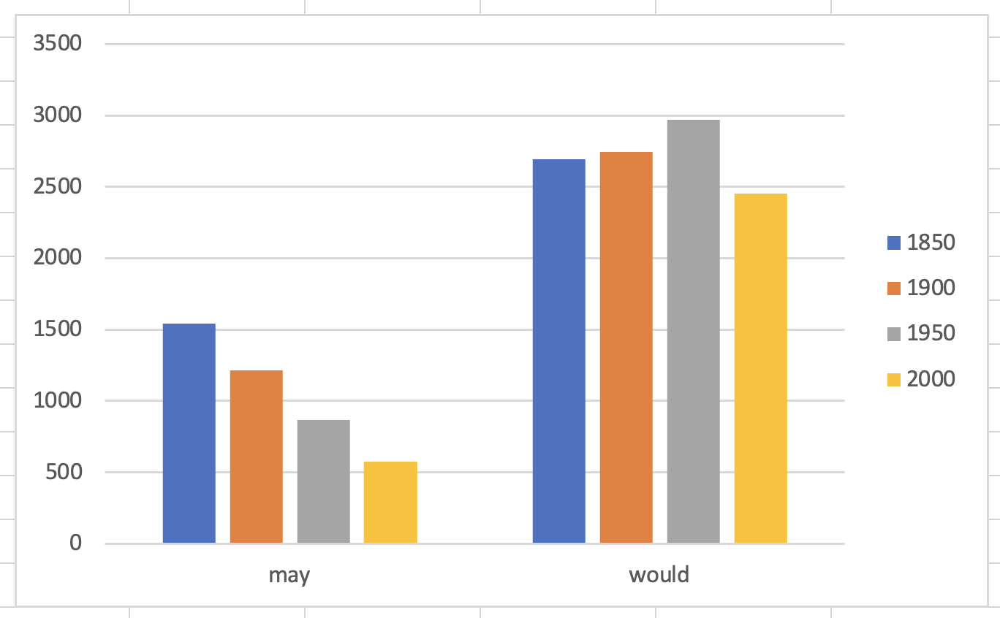
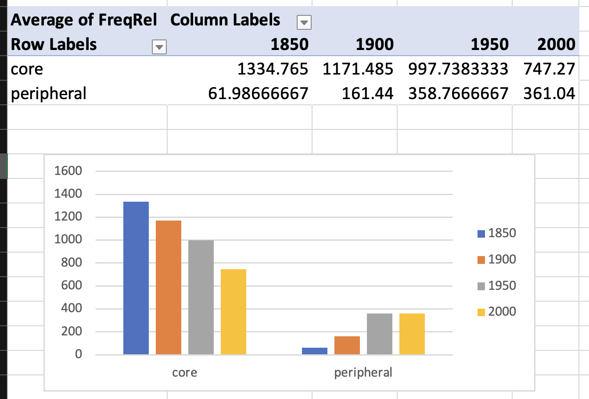
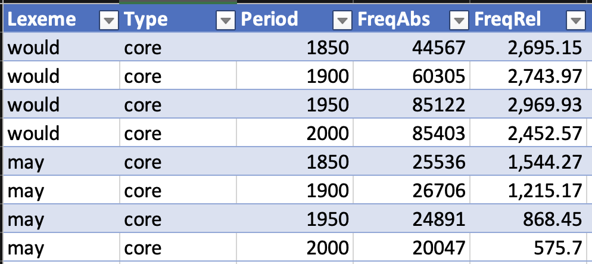
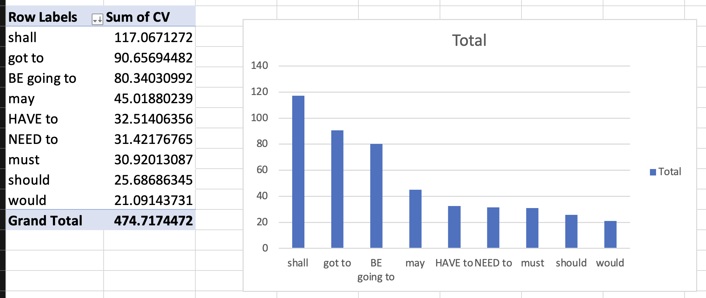
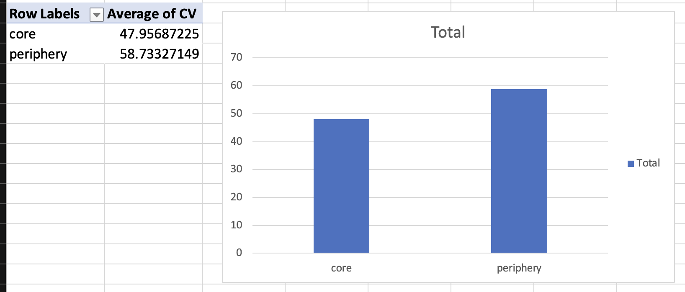

# Session Overview

- Introduction to language change research
- Modal verbs in English: frequency changes over time
    - theory: @Hilpert2015Grammatical
        - core vs peripheral modal verbs
        - frequency changes in COHA
        - text type variation in COCA
    - practice: corpus analysis with english-corpora.org

::: {.notes}
10:17–10:19 introduce session aims
:::

# Language Change Research

## What is language change?

- systematic modifications in language over time
- affects all linguistic levels: phonology, morphology, syntax, semantics
- corpus linguistics provides empirical evidence for change
- diachronic corpora enable quantitative analysis

::: {.notes}
10:19–10:22 introduce language change concepts
:::

## Research Questions in Language Change

- **What** changes? (linguistic features)
- **When** does it change? (timing and pace)
- **How** does it change? (mechanisms and patterns)
- **Why** does it change? (causes and motivations)
- **Who** changes? (social factors)

::: {.notes}
10:22–10:25 outline research framework
:::

## Corpus Methods for Language Change

- **Diachronic corpora**: COHA, NOW, EEBO, etc.
- **Frequency analysis**: absolute and relative frequencies over time
- **Collocation analysis**: changing semantic associations
- **Text type variation**: register-specific changes
- **Statistical measures**: coefficient of variation, significance testing

::: {.notes}
10:25–10:28 discuss methodological approaches
:::

# Modal Verbs in English

## Core Modal Verbs

- *will*, *would*
- *can*, *could*
- *may*, *might*
- *shall*, *should*
- *must*

::: {.notes}
10:28–10:30 introduce core modals
:::

## Peripheral Modal Verbs

- *BE going to*
- *have to*
- *got to*
- *need to*

::: {.notes}
10:30–10:32 introduce peripheral modals
:::

## Frequency Changes Over Time

### Declining Core Modals

- *would*, *may*, *should*, *must*, *shall*

___

### Rising Peripheral Modals

- *BE going to*, *have to*, *got to*, *need to*

::: {.notes}
10:32–10:35 present frequency trends
:::

## Theoretical Framework

@Hilpert2015Grammatical: Grammaticalization and the English system of modal verbs

- examines frequency changes in COHA (1810–2009)
- analyses text type variation in COCA
- explores interaction between frequency and semantic change
- identifies grammaticalization patterns

::: {.notes}
10:35–10:38 introduce theoretical background
:::

# Practice: Corpus Analysis

## Study Objectives

1. **Frequency analysis**: track modal verb usage over time in COHA
2. **Text type variation**: examine register preferences in COCA
3. **Statistical analysis**: calculate coefficient of variation
4. **Interpretation**: link patterns to language change processes

::: {.notes}
10:38–10:42 outline practice objectives
:::

## Corpus Resources

### COHA (Corpus of Historical American English)
- 400+ million words, 1810–2009
- decade-by-decade analysis possible
- fiction and non-fiction texts

___

### COCA (Corpus of Contemporary American English)
- 1+ billion words, 1990–present
- text type categories: spoken, fiction, magazine, newspaper, academic
- enables register analysis

___

## Using english-corpora.org

- **List view**: detailed concordance lines
- **Chart view**: frequency over time
- **Query syntax**: lexemes, wildcards, word classes
- **Collocations**: semantic associations

::: {.notes}
10:42–10:45 introduce corpora
:::

## Step 1: Frequency Analysis in COHA

### Target Decades
- 1850, 1900, 1950, 2000

### Query Strategy
- Core modals: `can_v _v`, `will_v _v`, etc.
- Peripheral modals: `HAVE_v to VERB`, `BE_V going to VERB`

### Data Collection
- absolute frequencies per decade
- relative frequencies (per million words)
- create Excel spreadsheet for analysis

::: {.notes}
10:45–10:52 explain frequency analysis
:::

## Step 2: Text Type Analysis in COCA

### Query Patterns
- Core modals: `can_v *_v`
- Peripheral modals: `BE going to *_v`

### Text Type Categories
- spoken, fiction, magazine, newspaper, academic

### Analysis Method
- frequency distribution across registers
- coefficient of variation calculation
- identify register preferences

::: {.notes}
10:52–10:57 explain text type analysis
:::

## Step 3: Statistical Analysis

### Coefficient of Variation (CV)
- CV = (Standard Deviation / Mean) × 100
- measures relative variability
- higher CV = more variation across text types

___

### Excel Calculation
1. Calculate mean: `=AVERAGE(range)`
2. Calculate standard deviation: `=STDEV.S(range)`
3. Calculate CV: `=(STDEV/MEAN)*100`

### Interpretation
- CV < 15%: low variation
- CV 15–35%: moderate variation
- CV > 35%: high variation

::: {.notes}
10:57–11:02 explain statistical methods
:::

## Expected Results

### Frequency Changes
- core modals: declining trend
- peripheral modals: rising trend
- different rates of change for individual modals

___

### Text Type Variation
- some modals show high register specificity
- others are more evenly distributed
- CV values indicate degree of specialization

::: {.notes}
11:02–11:05 discuss expected patterns
:::

# Hands-on Practice

## Group Work Setup

- **Groups**: 3–4 students per group
- **Duration**: 30 minutes
- **Tasks**: 
    - frequency analysis for assigned modals
    - text type variation analysis
    - statistical calculations
- **Output**: Excel spreadsheet with results

::: {.notes}
11:05–11:08 explain group work
11:08–11:38 hands-on practice (30 minutes)
:::

## Research Questions

1. Which modal verbs show the strongest frequency changes?
2. Are there differences between core and peripheral modals?
3. Which modals show the highest text type variation?
4. How do frequency changes relate to text type preferences?

::: {.notes}
11:08–11:12 present research questions
:::

## Data Collection Template

Excel template with:
- frequency data by decade
- text type distribution
- statistical calculations
- chart templates for visualization

::: {.notes}
11:12–11:15 introduce template
:::

# Discussion and Interpretation

## Language Change Mechanisms

- **Grammaticalization**: lexical items → grammatical markers
- **Semantic bleaching**: loss of specific meaning
- **Frequency changes**: usage patterns over time
- **Register specialization**: domain-specific usage

___

## Implications for Language Change

- modal verb system undergoing restructuring
- peripheral modals gaining ground
- register differences reflect change in progress
- corpus evidence supports theoretical models

::: {.notes}
11:15–11:20 discuss mechanisms
:::

## Implications for Language Change

- modal verb system undergoing restructuring
- peripheral modals gaining ground
- register differences reflect change in progress
- corpus evidence supports theoretical models

::: {.notes}
11:20–11:25 discuss implications
:::

## Methodological Reflections

- advantages of corpus-based approach
- challenges of diachronic analysis
- importance of statistical measures
- limitations of frequency data

___

::: {.notes}
11:25–11:30 reflect on methods
:::

# Summary

- language change research requires diachronic corpora
- modal verbs show systematic frequency changes
- text type variation reveals change mechanisms
- statistical analysis supports interpretation
- corpus methods provide empirical evidence

::: {.notes}
11:30–11:35 session wrap-up
:::

___

# Break

::: {.notes}
11:35–11:40 break
:::

# Next Session Preview

- research project presentations
- final course wrap-up
- methodological reflections

::: {.notes}
11:35–11:40 preview next session
:::

# References