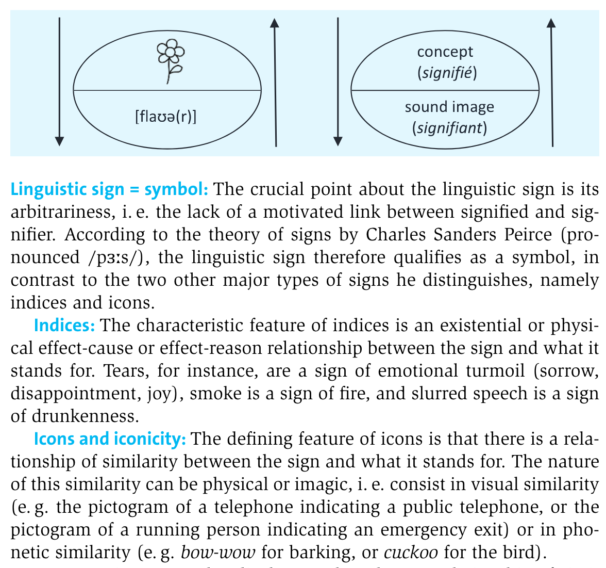

- organisation
  collapsed:: true
	- registration
	  collapsed:: true
		- open issues?
	- requirements
	  collapsed:: true
		- {{embed [[requirements]]}}
			-
- [[Sketch Engine]] tutorial: [((661fc639-0d3c-4679-9b37-906063c34cb7))]
- [[lexis]] and [[lexical innovation]] in corpora
	- background on [[lexis]] / [[lexical innovation]]
	  collapsed:: true
		- cultural and linguistic innovation
		  collapsed:: true
			- society continually changes as new practices and products emerge (e.g. smartphones)
			- these changes typically first manifest themselves in language on the level of lexis in the form of [[neologisms]] (e.g. the words *smartphone* or *iphone*)
				- Which recent neologisms can you think of?
					- {{renderer excalidraw, excalidraw-2024-04-25-23-36-02}}
		- [[theoretical framework]]: the [conventionality]([[conventionalization]]) of words
			- [[Model of the Linguistic Sign (de Saussure)]]
			  collapsed:: true
				- 
				  ([[Kortmann2020EnglishLinguistics]]: 7)
			- the [[S-curve model]] of [linguistic innovation]([[linguistic innovation]]), [[diffusion]], and [change]([[language change]])
			  collapsed:: true
				- {{embed ((6447af61-6674-4374-9bab-a132f1af0f01))}}
			- [[EC-Model]] ([[Schmid2015Blueprint]], [[Schmid2020Dynamics]])
			  collapsed:: true
				- the more frequently a word is used, the more likely it is
					- that speakers have stored it in their [[mental lexicon]] ([[entrenchment]])
					- that it is part of the conventional language system of a language ([[conventionalization]])
				- {{embed ((6447aec5-f6ed-4fc0-99e4-23a9d1ea761f))}}
		- [[operationalization]]
			- [[frequency]] as an indicator for [[entrenchment]] and [conventionality]([[conventionalization]]) ([[Stefanowitsch2017Corpusbased]])
			  id:: 646c7ffc-80c0-4526-935c-4c5f3d015114
			  collapsed:: true
				- [[corpus-as-input]]: language used in corpora represents potential [[exposure]] to speakers
				- [[corpus-as-output]]: languaged used by speakers in corpora represents potential degrees of entrenchment
	- [[practice]]
	  id:: 6447bb36-3911-4021-9189-797e35ab5c8b
		- [[concordance]]
			- in the [[enTenTen20]] corpus
				- search for attestations of the word *smartphone*
				- search for attestations of the pattern `ADJ + SMARTPHONE` (i.e. the [lemmatized]([[lemmatization]]) [[word type]] , including *smartphones*)
				- search for attestations of the pattern `TAKE a LOOK at NOUN`
		- [[frequency]] analysis
		  collapsed:: true
			- in the [[enTenTen20]] corpus, identify the most common adjectives in the pattern `ADJ SMARTPHONE`
			- in the [[English Historical Book Collection (EEBO, ECCO, Evans)]] corpus
				- identify which words have exhibited the highest increase in usage frequency by using the `trends` feature
				- get an overview of the frequency increase of the word which has shown the most positive trend
				-