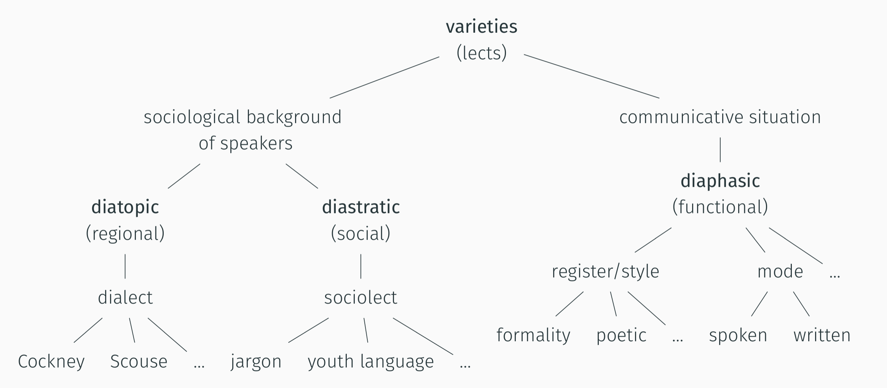
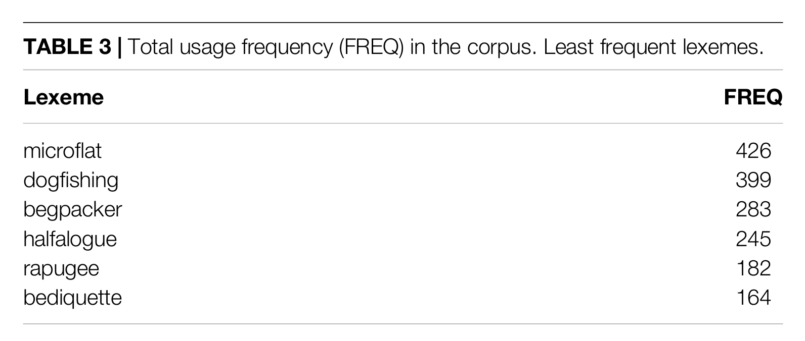
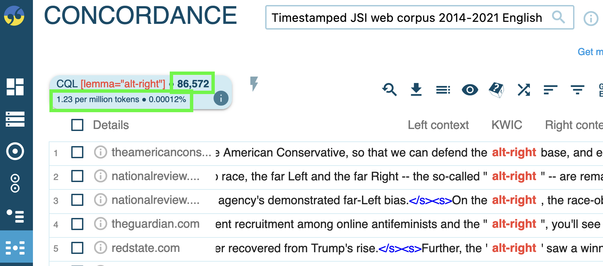
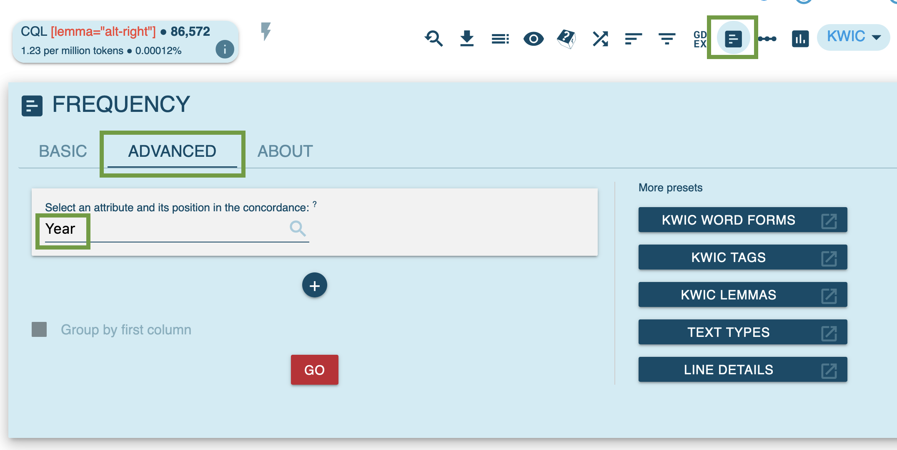
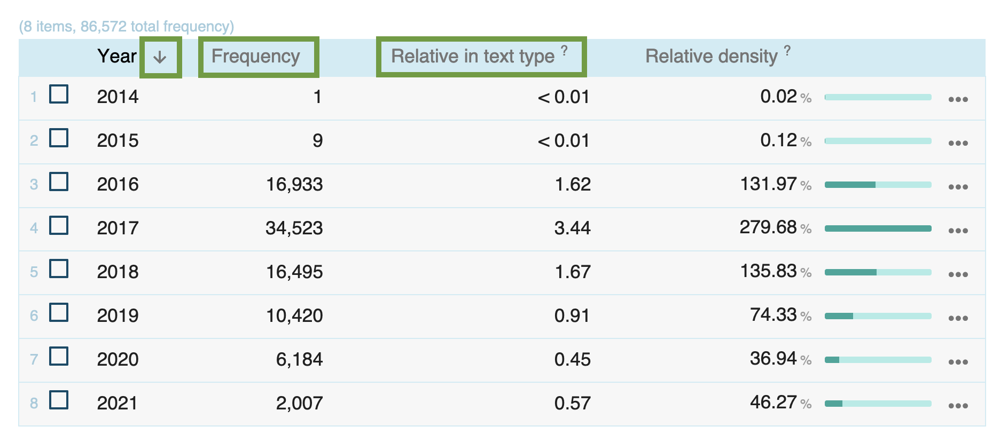
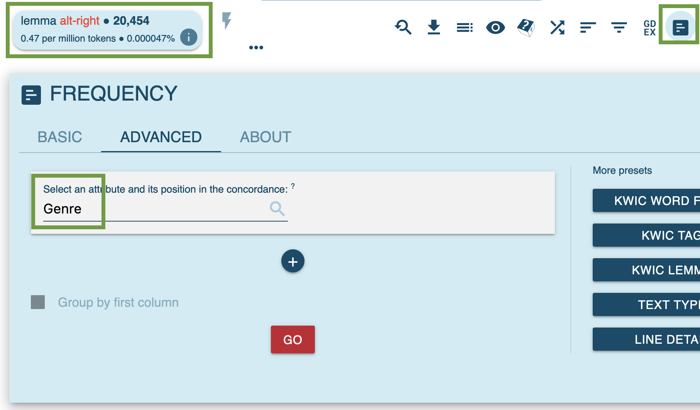
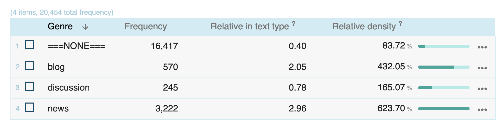

tags:: session

- # theory: lexical innovation
  collapsed:: true
	- ## conventionalization & diffusion
	  collapsed:: true
		- ### [[EC-Model]]
		  collapsed:: true
			- {{embed ((6447aec5-f6ed-4fc0-99e4-23a9d1ea761f))}}
		- ### dynamics of diffusion over time
		  collapsed:: true
			- {{embed ((6447af61-6674-4374-9bab-a132f1af0f01))}}
		- ### pathways of [[diffusion]]
		  collapsed:: true
			- types of [linguistic variation]([[linguistic variation]]) and diffusion
			  collapsed:: true
				- 
			- dimensions of diffusion
			  collapsed:: true
				- across speakers and communities
				- across text types
			- examples for different degrees of diffusion
			  collapsed:: true
				- 
	- ## [using frequency]([[frequency]]) as an indicator of conventionality and diffusion
	  collapsed:: true
		- ### operationalization
		  collapsed:: true
			- [[corpus-as-input]] and [[corpus-as-output]]
			- [[entrenchment]] and [[conventionalization]]
		- ### frequency measures (examples from [[Würschinger2021Social]])
		  collapsed:: true
			- raw frequency
			  collapsed:: true
				- most frequent
				  collapsed:: true
					- 
					- typically most frequent in English
					  collapsed:: true
						- more formal:
						  collapsed:: true
							- *the*
							- *a(n)*
							- *of*
						- more conversational
						  collapsed:: true
							- *BE*
							- *I*, *you*
						- *I can_[mod aux] can_[fv] a can_[noun].*
				- around the median
				  collapsed:: true
					- 
				- least frequent
				  collapsed:: true
					- 
				- case study selection
				  id:: 6450f28f-eafd-4c42-a56d-50f417b67585
					- 
			- cumulative frequency
			  collapsed:: true
				- 
			- frequency over time ([[diachronic]])
			  collapsed:: true
				- raw frequency
					- 
					  id:: 64b64be4-1988-49fa-b124-e67e4ea3c00e
				- relative frequency
					- 
					  collapsed:: true
						- frequency of *blockchain* over time (text type `year`) in the [[Timestamped JSI web corpus 2014-2021 English]]
						- [[Sketch Engine]] documentation ([link](https://www.sketchengine.eu/my_keywords/relative-text-type-frequency/))
						  collapsed:: true
							- Relative  text type  frequency compares the frequency in a specific text type to the frequency in the whole  corpus.
							- It shows how typical the word(s) is of a specific text type, e.g. of 
							  the spoken part of the corpus or of a particular website where the texts
							   were downloaded from.
							- The number is the relative frequency of the  query  result divided by the relative size of the particular text type. It can be interpreted as *how much more/less frequent is the result of the query in this text type compared to the whole corpus*.
						- another popular measure: *frequency per million words* (pmw)
			- [diffusion]([[diffusion]]) across communities
			  collapsed:: true
				- 
			- frequency across text types ([[text type/variation]])
			  collapsed:: true
				- distribution of the use of *blockchain* across topics in the [[enTenTen20]] corpus on [[Sketch Engine]]
					- 
					  id:: 64b64be4-92a2-45aa-a795-5c79e22375dd
- # practice: studying lexical innovation using corpora
  id:: 6450dc50-0db4-4ce1-a6e5-7440beb8e766
	- using the case study words from [[Würschinger2021Social]],
		- *upskill*
		- *hyperlocal*
		- *solopreneur*
		- *alt-right*
		- *alt-left*
		- *poppygate*
	- for each of these words, using [[Sketch Engine]],
		- in the [[Timestamped JSI web corpus 2014-2021 English]], determine
			- its total [frequency]([[frequency]])
			  collapsed:: true
				- for [[alt-right]]
					- query: `[lemma="alt-right"]`
					- result
						- 
						  collapsed:: true
							- absolute total frequency: `86,572`
							- relative total frequency: `1.23` per million words/tokens (pmw)
			- its [frequency]([[frequency]]) over time: which was the `Year` it was used the most?
			  collapsed:: true
				- 
				- 
				  collapsed:: true
					- sort by year
					- `Frequency`: raw frequency
					- `Relative in text type`: relative frequency (per million words)
		- in the [[enTenTen20]] corpus, determine
			- in which `Topic` was it used the most? ([[text type]])
			  collapsed:: true
				- for [[alt-right]]
					- 
					- 
		- take notes and compare your results
			- which words show highest/lowest degrees of [conventionality]([[conventionalization]])?
			  collapsed:: true
				- in the [[Timestamped JSI web corpus 2014-2021 English]]
					- using the query, e.g., `[lemma="alt-left"]`
						- |Lexeme|FreqAbs|FreqRel|
						  |:---|---:|----:|
						  |*alt-right*|86,572|1.23|
						  |*upskill*|23,303|0.33|
						  |*hyperlocal*|16,699|0.24|
						  |*solopreneur*|3,843|0.05|
						  |*alt-left*|3,665|0.05|
						  |*poppygate*|15|< 0.01|
			- for which words is there a discrepancy to the results on Twitter?
			  collapsed:: true
				- {{embed ((6450f28f-eafd-4c42-a56d-50f417b67585))}}
				- *upskill* and *hyperlocal* ranked higher -> in line with [[social network analysis]] in [[Würschinger2021Social]]
		- follow-up: create charts in [Excel]([[Microsoft Excel]])