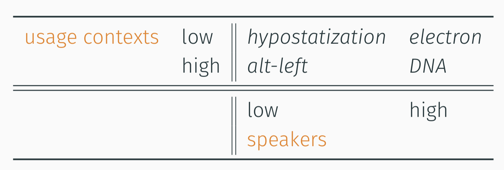
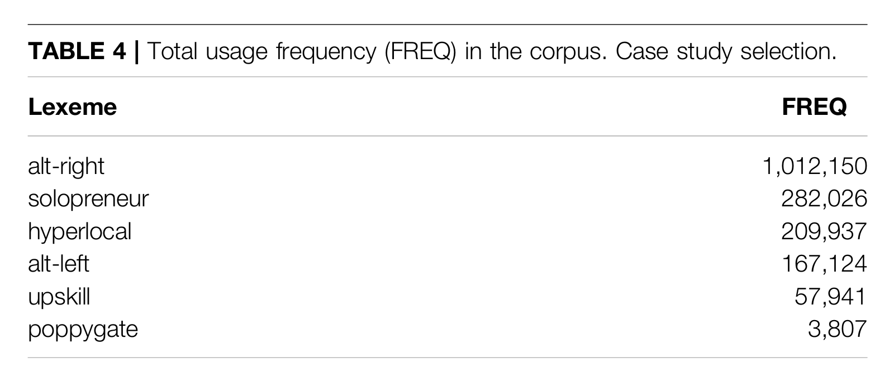
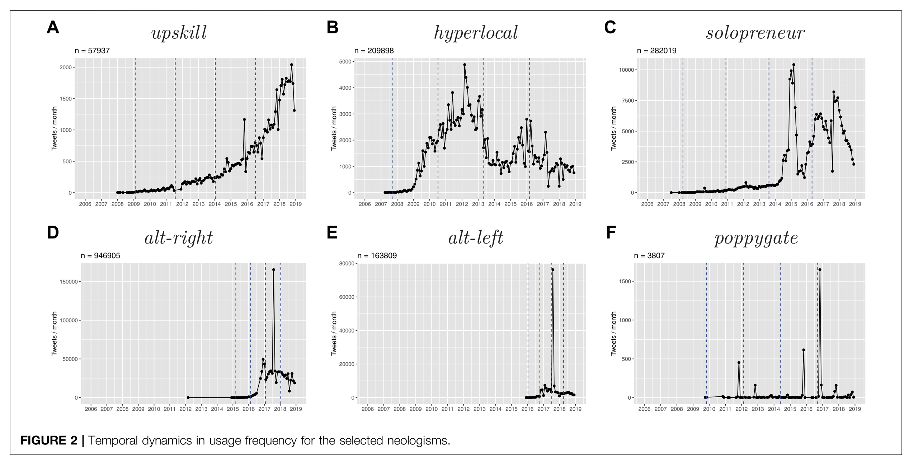
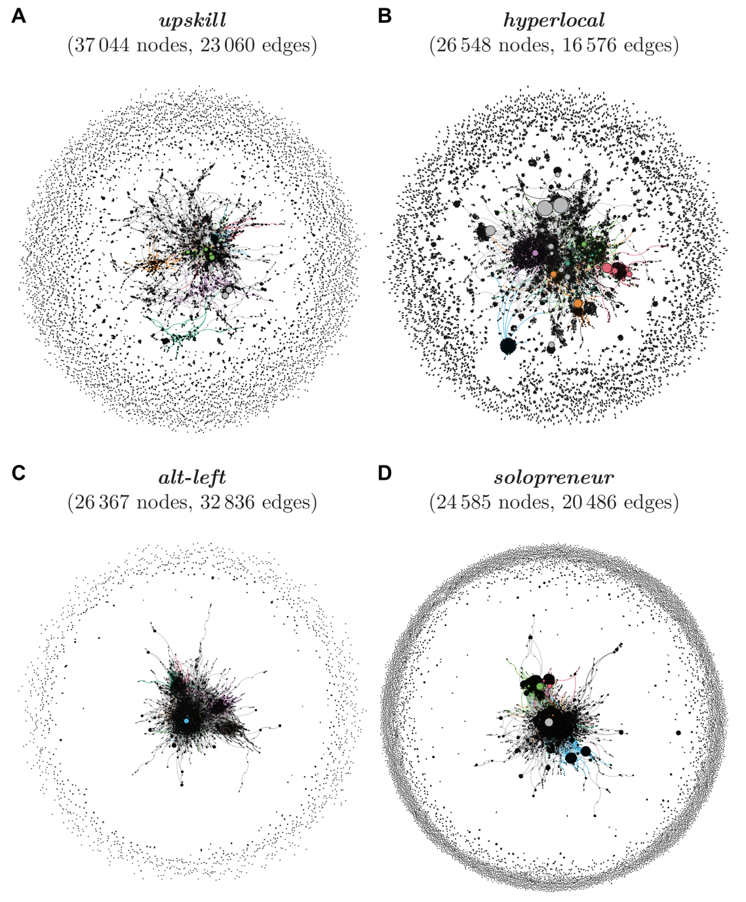
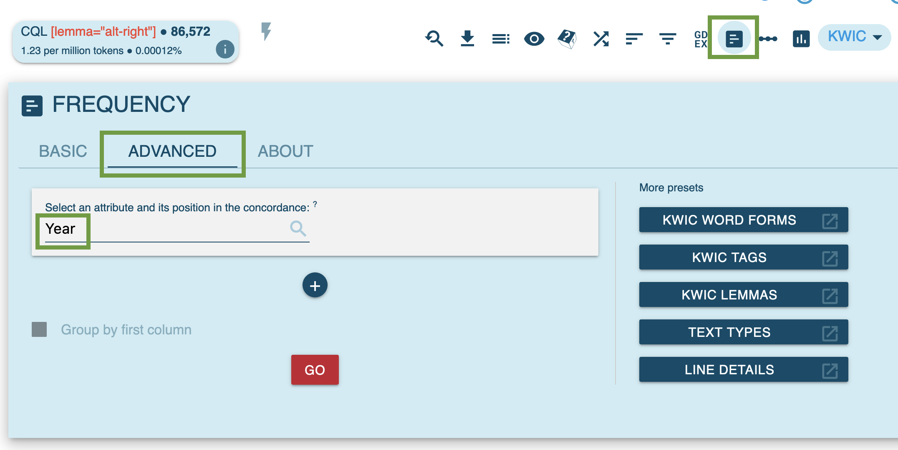
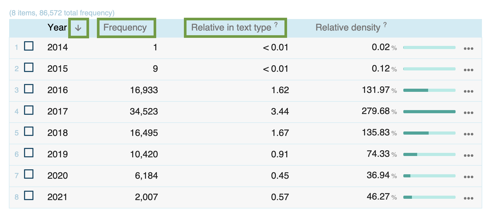
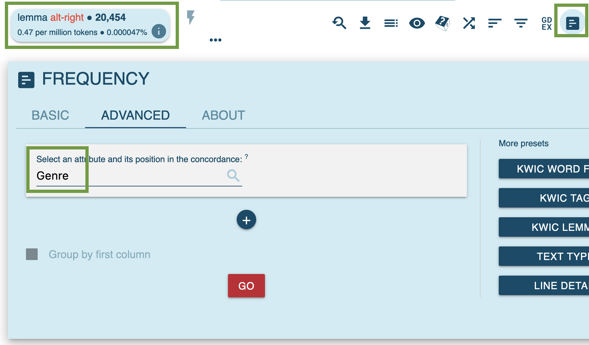

- [[lexis]] and [[lexical innovation]]
	- cultural and linguistic innovation
		- society continually changes as new practices and products emerge (e.g. smartphones)
		- these changes typically first manifest themselves in language on the level of lexis in the form of [[neologisms]] (e.g. the words *smartphone* or *iphone*)
			- hypostatization
		- Which recent neologisms can you think of?
			- {{renderer excalidraw, excalidraw-2024-05-03-10-14-19}}
		- knowledge of words is [conventional]([[conventionalization]]): speakers learn form-meaning pairings
			- [[Model of the Linguistic Sign (de Saussure)]]
				- 
	- [[theoretical framework]]
		- the [[S-curve model]] of [linguistic innovation]([[linguistic innovation]]), [[diffusion]], and [change]([[language change]])
			- {{embed ((6447af61-6674-4374-9bab-a132f1af0f01))}}
		- [[EC-Model]] ([[Schmid2015Blueprint]], [[Schmid2020Dynamics]])
			- the more frequently a word is used, the more likely it is
				- that speakers have stored it in their [[mental lexicon]] ([[entrenchment]])
				- that it is part of the conventional language system of a language ([[conventionalization]])
			- {{embed ((6447aec5-f6ed-4fc0-99e4-23a9d1ea761f))}}
	- [[operationalization]]
		- [[frequency]] as an indicator for [[entrenchment]] and [conventionality]([[conventionalization]]) ([[Stefanowitsch2017Corpusbased]])
		  id:: 646c7ffc-80c0-4526-935c-4c5f3d015114
			- [[corpus-as-input]]: language used in corpora represents potential [[exposure]] to speakers
			- [[corpus-as-output]]: languaged used by speakers in corpora represents potential degrees of entrenchment
	- pathways of [[diffusion]]
		- types of [linguistic variation]([[linguistic variation]]) and diffusion
			- 
			  id:: 661fc637-111b-46ca-a31a-9b9ce19b36da
		- dimensions of diffusion
			- across speakers and communities
			- across text types
		- examples for different degrees of diffusion
		  id:: 661fc637-55aa-4923-ab9c-e47d68be946d
			- 
	- [using frequency]([[frequency]]) as an indicator of conventionality and diffusion
		- frequency measures (examples from [[Würschinger2021Social]])
			- raw frequency
				- most frequent
					- 
					- typically most frequent in English
						- more formal:
							- *the*
							- *a(n)*
							- *of*
						- more conversational
							- *BE*
							- *I*, *you*
						- *I can_[mod aux] can_[fv] a can_[noun].*
				- around the median
					- 
				- least frequent
					- 
				- case study selection
				  id:: 6450f28f-eafd-4c42-a56d-50f417b67585
					- 
			- cumulative frequency
				- 
				  id:: 661fc637-9b16-4754-8d6f-df95979a8a98
			- frequency over time ([[diachronic]])
				- 
				  id:: 64b64be4-1988-49fa-b124-e67e4ea3c00e
			- [diffusion]([[diffusion]]) across communities
				- 
				  id:: 661fc637-9ab5-4e56-aa05-d178f243c1c2
	- using [[Sketch Engine]]
		- [[diachronic]] [[frequency]] of *blockchain* in the [[English Trends (2014–today)]] corpus
			- ([Sketch Engine results link](https://app.sketchengine.eu/#concordance?corpname=preloaded%2Ftrends_en&tab=advanced&queryselector=cql&attrs=word&viewmode=kwic&attr_allpos=all&refs_up=0&shorten_refs=1&glue=1&gdexcnt=300&show_gdex_scores=0&itemsPerPage=20&structs=s%2Cg&refs=%3Ddoc.date&default_attr=lemma&cql=%5Blemma%3D%22blockchain%22%5D&showresults=1&showTBL=0&tbl_template=&gdexconf=&cb=slemma%3D%22blockchain%22&f_tab=basic&f_showrelfrq=1&f_showperc=0&f_showreldens=0&f_showreltt=0&c_customrange=0&t_attr=doc.quarter&t_absfrq=0&t_trimempty=1&t_threshold=5&operations=%5B%7B%22name%22%3A%22cql%22%2C%22arg%22%3A%22%5Blemma%3D%5C%22blockchain%5C%22%5D%22%2C%22query%22%3A%7B%22queryselector%22%3A%22cqlrow%22%2C%22cql%22%3A%22%5Blemma%3D%5C%22blockchain%5C%22%5D%22%2C%22default_attr%22%3A%22lemma%22%7D%2C%22id%22%3A5708%7D%5D))
			- timeline view
				- 
				  id:: 66341991-db1e-4294-a3ec-fc01b25ab5fc
			- frequency view
				- frequency of *blockchain* over time (text type `year`)
					- 
					- 
				- [[Sketch Engine]] documentation ([link](https://www.sketchengine.eu/my_keywords/relative-text-type-frequency/))
					- Relative text type frequency compares the frequency in a specific text type to the frequency in the whole  corpus.
					- It shows how typical the word(s) is of a specific text type, e.g. of 
					  the spoken part of the corpus or of a particular website where the texts
					   were downloaded from.
					- The number is the relative frequency of the query result divided by the relative size of the particular text type. It can be interpreted as *how much more/less frequent is the result of the query in this text type compared to the whole corpus*.
				- another popular measure: *frequency per million words* (pmw)
		- frequency across [text types]([[text type/variation]]) in the [[enTenTen21]] corpus
			- [SkE results](https://app.sketchengine.eu/#concordance?corpname=preloaded%2Fententen21_tt31&tab=advanced&queryselector=cql&attrs=word&viewmode=kwic&attr_allpos=all&refs_up=0&shorten_refs=1&glue=1&gdexcnt=300&show_gdex_scores=0&itemsPerPage=20&structs=s%2Cg&refs=%3Ddoc.website&default_attr=lemma&cql=%5Blemma%3D%22alt-right%22%5D&showresults=1&showTBL=0&tbl_template=&gdexconf=&cb=slemma%3D%22alt-right%22&f_tab=advanced&f_showrelfrq=1&f_showperc=0&f_showreldens=1&f_showreltt=1&c_customrange=0&t_attr=&t_absfrq=0&t_trimempty=1&t_threshold=5&operations=%5B%7B%22name%22%3A%22cql%22%2C%22arg%22%3A%22%5Blemma%3D%5C%22alt-right%5C%22%5D%22%2C%22query%22%3A%7B%22queryselector%22%3A%22cqlrow%22%2C%22cql%22%3A%22%5Blemma%3D%5C%22alt-right%5C%22%5D%22%2C%22default_attr%22%3A%22lemma%22%7D%2C%22id%22%3A6249%7D%5D)
			- distribution of the use of *alt-right* across the `Topic` text type
			  id:: 6634a08d-5bd9-4d04-ad79-fb7ea79b1a7e
				- 
				  id:: 64b64be4-92a2-45aa-a795-5c79e22375dd
- [[practice]]: studying lexical innovation using corpora
  id:: 6450dc50-0db4-4ce1-a6e5-7440beb8e766
	- using the case study words from [[Würschinger2021Social]],
		- *upskill*
		- *hyperlocal*
		- *solopreneur*
		- *alt-right*
		- *alt-left*
		- *poppygate*
	- for each of these words, using [[Sketch Engine]],
		- in the [[English Trends (2014–today)]], corpus determine
			- its total [frequency]([[frequency]])
				- for [[alt-right]]
					- query: `[lemma="alt-right"]`
					- result
						- 
							- absolute total frequency: `86,572`
							- relative total frequency: `1.23` per million words/tokens (pmw)
			- its [frequency]([[frequency]]) over time: which was the `Year` it was used the most?
				- 
				- 
					- sort by year
					- `Frequency`: raw frequency
					- `Relative in text type`: relative frequency (per million words)
		- in the [[enTenTen21]] corpus, determine
			- in which `Genre` was it used the most? ([[text type]])
				- e.g. for [[alt-right]]
					- 
					- 
		- take notes and compare your results
			- which words show highest/lowest degrees of [conventionality]([[conventionalization]])?
				- in the [[English Trends (2014–today)]]
					- using the query, e.g., `[lemma="alt-left"]`
						- |Lexeme|FreqAbs|FreqRel|
						  |:---|---:|----:|
						  |*alt-right*|86,572|1.23|
						  |*upskill*|23,303|0.33|
						  |*hyperlocal*|16,699|0.24|
						  |*solopreneur*|3,843|0.05|
						  |*alt-left*|3,665|0.05|
						  |*poppygate*|15|< 0.01|
			- for which words is there a discrepancy to the results on Twitter?
				- {{embed ((6450f28f-eafd-4c42-a56d-50f417b67585))}}
		- follow-up: create charts in [Excel]([[Microsoft Excel]])