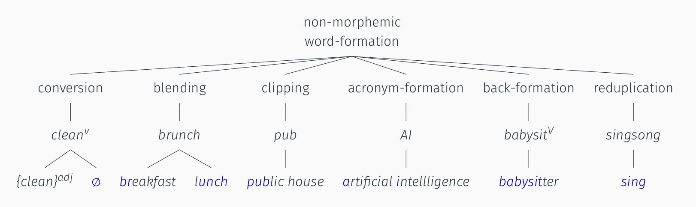
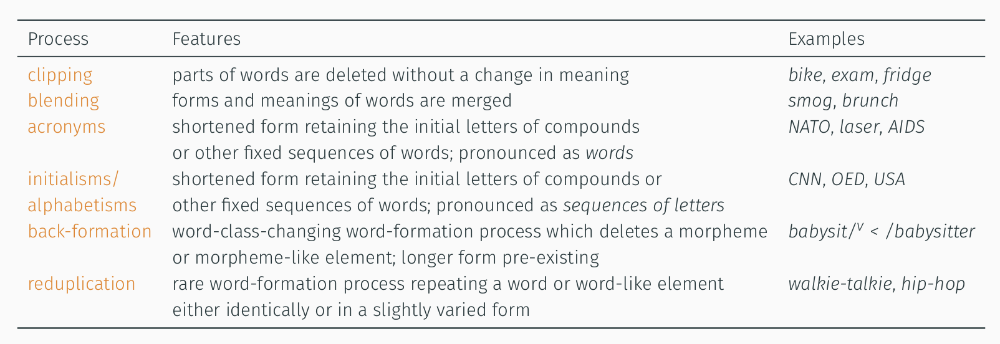
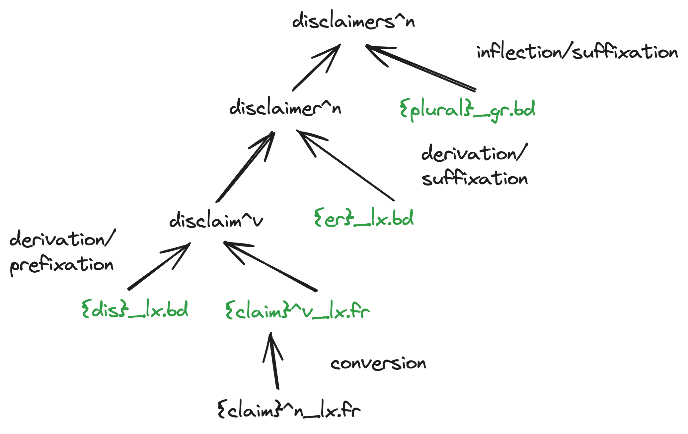
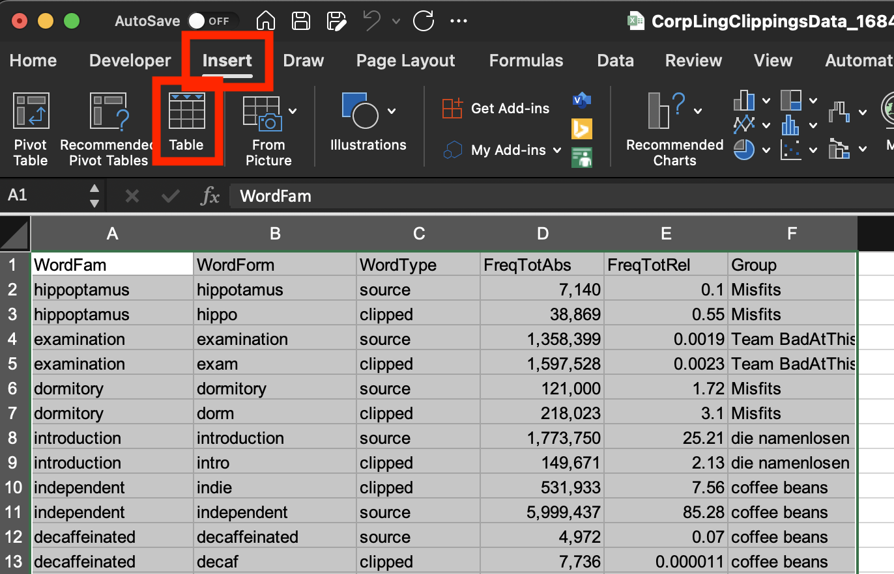
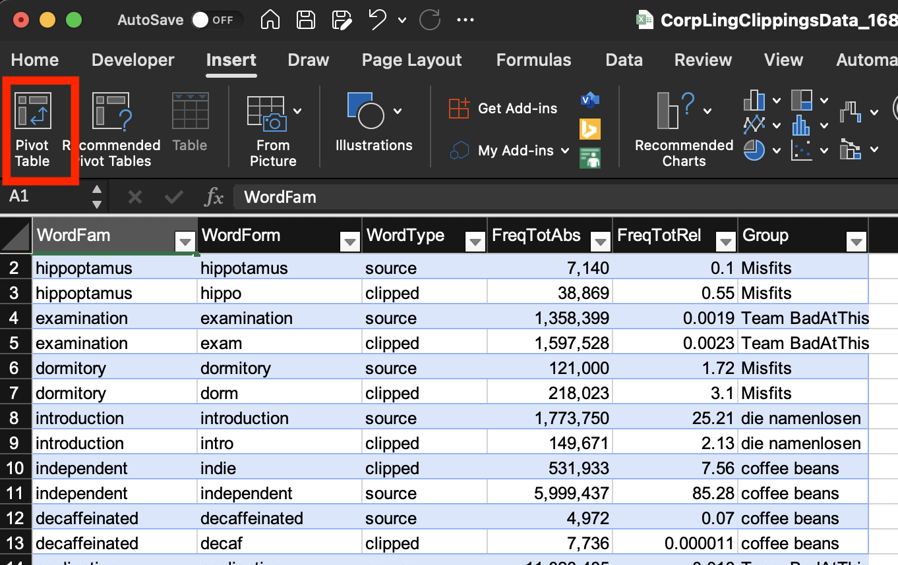
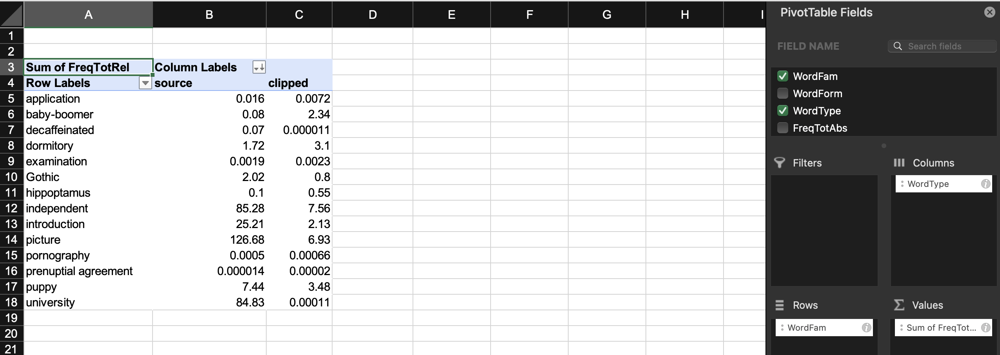

- recap: studying lexis on Sketch Engine
  collapsed:: true
	- {{embed ((6450dc50-0db4-4ce1-a6e5-7440beb8e766))}}
- fundamentals in [[morphology and word-formation]]
  collapsed:: true
	- [morphology]([[morphology]]) vs [word-formation]([[word-formation]])
	  collapsed:: true
		- 
		  [[Schmid2016EnglishMorphology]]: 15
	- overview of [word-formation]([[word-formation]]) processes
	  collapsed:: true
		- {:height 434, :width 487}
		  id:: 64b64be4-310c-429c-bc18-9975c6721409
	- [morphemic word-formation]([[word-formation/morphemic]]) processes
	  collapsed:: true
		- {:height 458, :width 429}
	- [non-morphemic word-formation]([[word-formation/non-morphemic]]) processes
	  collapsed:: true
		- overview
		  collapsed:: true
			- {:height 229, :width 693}
		- characteristics
		  collapsed:: true
			- 
		- [lexical innovation]([[lexical innovation]]) in the form of [[semantic neologisms]]
		  collapsed:: true
			- [[denotational]] [[meaning]]: changes and variation in core meaning
			- [[connotational]] [[meaning]]: changes and variation in the associative signature of words (e.g. social, stylistic)
	- [[practice]]: Analyze the word-formation processes involved in the following complex words.
	  collapsed:: true
		- example: morphological stemma of *disclaimers*
			- {{renderer excalidraw, excalidraw-2024-05-10-11-01-15}}
			- 
		- *childhood*
		  collapsed:: true
			- derivation / suffixation
		- *paperback*
		  collapsed:: true
			- compounding / exocentric
		- *study-bedroom*
		  collapsed:: true
			- compounding / copulative
		- *foreigner*
		  collapsed:: true
			- derivation / suffixation
		- *paleface*
		  collapsed:: true
			- compounding / exocentric
		- *Oxbridge*
		  collapsed:: true
			- blending
		- *CGEL*
		  collapsed:: true
			- initialism
		- *fridge*
		  collapsed:: true
			- clipping
- a corpuslinguistic study of clipping: [[Hilpert2023Meaning]]
  id:: 661fc638-03da-4aa7-a4e7-15c3ea5ba694
	- ((645a1add-5577-41b5-a719-4379a3fc72d5))
	- abstract
	  collapsed:: true
		- {{embed ((645a1b9e-f78b-46c6-a43e-262f285a67d2))}}
	- theoretical framework
	  id:: 661fc638-8ee3-4c63-8252-94500d90d702
		- alternative view in previous work: no difference between source and clipped forms
			- ((645a1fda-7e5f-4fa4-8572-25f32477431e))
		- authors’ framework
			- [[Principle of No Synonymy]]
				- ((645a1ffc-fe23-483c-bb95-d1e5ca0548e3))
			- [[usage-based approach]]
				- ((645a2047-f5a9-4026-93bd-036c4a482c66))
			- [[distributional hypothesis]]
				- ((645a20e9-f7b0-478b-bd31-d1fa07fdd451))
				- ((645a20d0-6b75-486f-9ba9-bbdf716dc685))
	- data
	  id:: 661fc638-c87c-43dd-99f7-43f003242132
		- dataset of clippings
			- ((645a2870-9ab6-4a81-941d-44fe6a3c121a))
		- corpus data
			- ((645a2087-0c80-4a30-838d-52a0d2c3e8fa))
	- method
	  collapsed:: true
		- analysing [[meaning]] based on
			- [[collocations]]
			- [[word embeddings]]
	- results
	  id:: 661fc638-a344-424e-887f-9d8dd21a6b23
		- variation across text types
			- ((645a1dbd-328b-464e-b703-0ef2c6ab114f))
			- {{embed ((645a2a9e-c7a6-4959-801f-dea28d63998f))}}
		- semantic differences
			- {{embed ((645a2b02-c578-4edc-b121-f5bca5a76389))}}
- [[practice]]: studying the ([[frequency]] of) use of [clippings]([[clipping]])
  id:: 645a1aa2-28a7-41f4-bf64-bc8afce0bfa4
	- using [[Sketch Engine]]
	  collapsed:: true
		- for the dataset of clippings from [[Hilpert2023Meaning]]
			- 
			  id:: 645a24aa-aa0c-4e46-87c3-3afc287b2a9a
		- for example pairs of (1) source words (e.g. *brother*) and (2) clipped form (e.g. *bro*)
		- determine their [[frequency]] in the [[enTenTen21]] corpus
		  id:: 645a1b1f-99b5-43c5-be5a-23f355169129
			- query: e.g. `[lemma="brother" & tag="N.*"]`
			- frequency types: absolute & relative frequency
	- using [[Microsoft Excel]]
	  collapsed:: true
		- collect results in [this](https://1drv.ms/x/s!AvkgNVl9yS6aokEnvVJ0U1qeQYe4) collaborative spreadsheet
		- analyse results
		  id:: 6463603a-25b8-468a-abff-524a6c75fe4f
			- insert `Table` for range of data
				- 
			- insert `Pivot Table` for `Table`
			  id:: 64b64be4-236a-4969-a3ba-f0d1c8234931
				- 
			- set `Rows`, `Values`, and `Columns`
				- 
				- remove `Grand Total` by right-click → remove
			- insert `Pivot Chart`
				- 
				  id:: 64b64be4-c0d9-4cdc-9fb7-294f9ca3ba27
				  collapsed:: true
	- potential further analyses
	  collapsed:: true
		- frequency over time in the [[English Trends (2014–today)]]
		- frequency by text type in the [[enTenTen21]] corpus
		- ((1e44dc00-0557-4672-9187-6986cf52b3e7))
		- studying long-term [[diachronic]] trends using [[english-corpora.org]]
		  collapsed:: true
			- [[NOW]] corpus
			- [[COCA]]