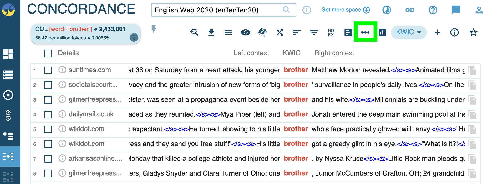
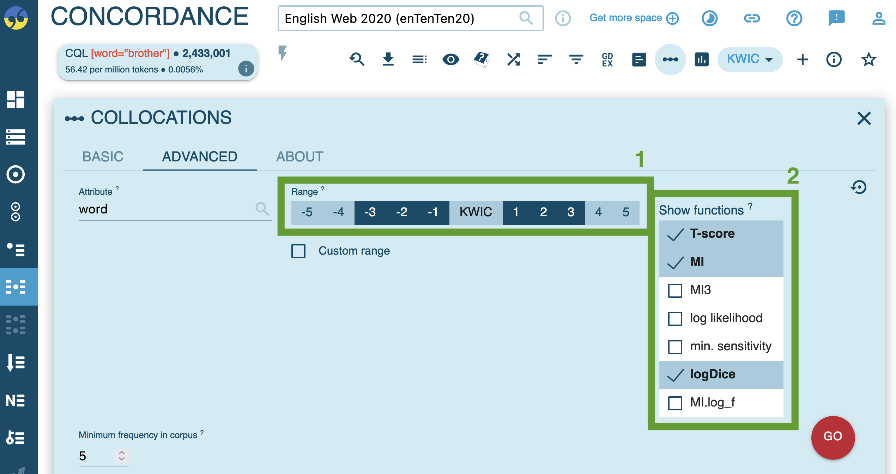
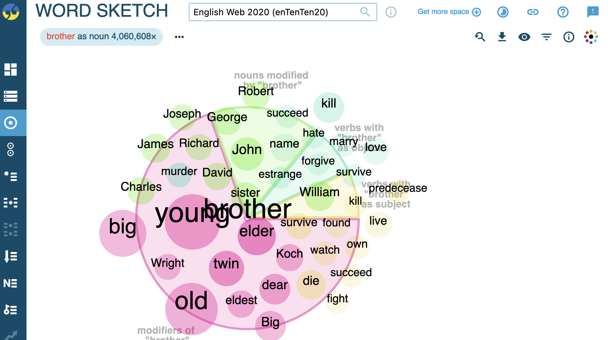
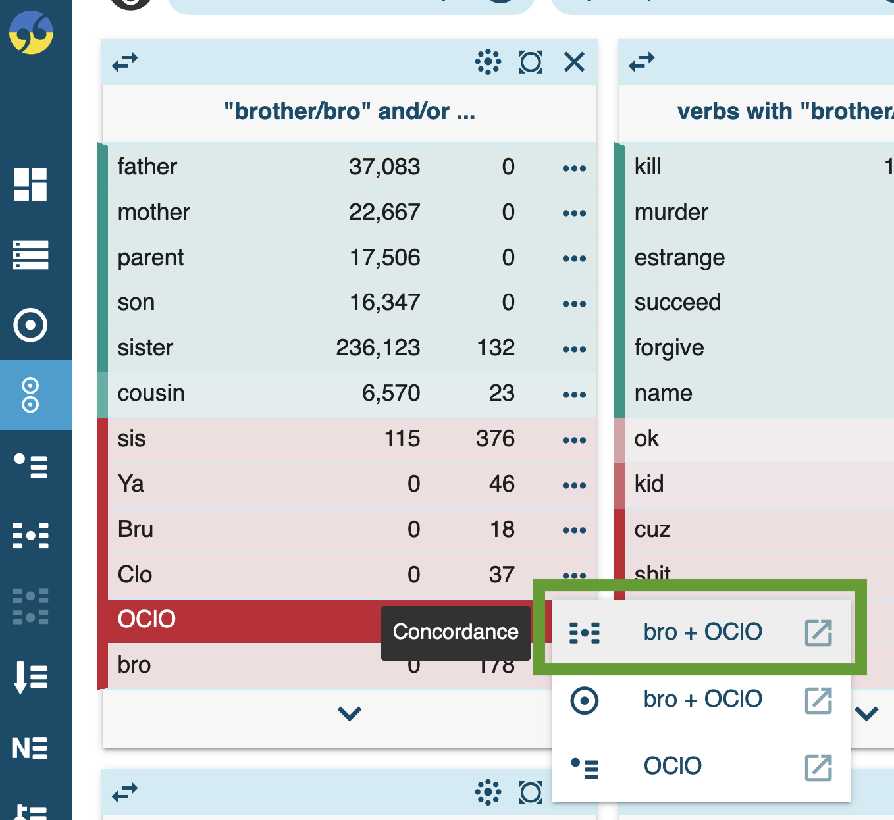
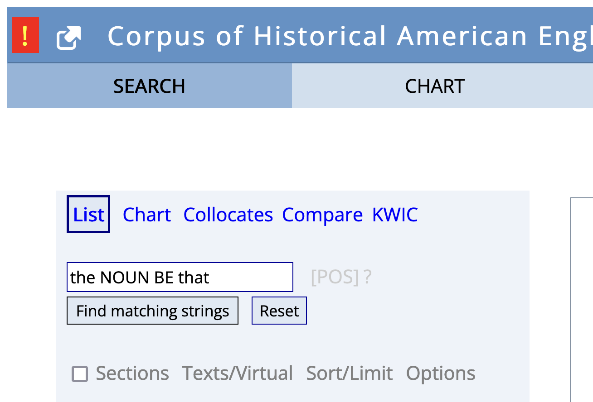

- # morphology
	- ## frequency-based analysis of clippings
	  collapsed:: true
		- {{embed ((645a1b1f-99b5-43c5-be5a-23f355169129))}}
	- ## studying [[semantics]] in the [[enTenTen20]] corpus
	  id:: 1e44dc00-0557-4672-9187-6986cf52b3e7
	  collapsed:: true
		- theoretical background on [[collocations]]
		  collapsed:: true
			- ((f67743f8-3c70-475b-993b-1f2eb4bc9a2f))
			- {{embed ((643e7a15-ed51-442c-876c-b0e501e8a7c1))}}
			- ((6447a7c9-0293-435b-8944-d989642d2fe4))
			- {{embed ((645a2b02-c578-4edc-b121-f5bca5a76389))}}
		- [[practice]]: studying semantics using collocations and [[word sketches]] in [[enTenTen20]] corpus on  [[Sketch Engine]]
			- [[collocations]]
			  collapsed:: true
				- run query to retrieve all occurrences and get concordance view (e.g. `[word="brother"]`)
					- {:height 246, :width 630}
					  id:: 646c7cfa-b90e-4b49-8cf4-c78f8e81c272
				- click on collocation analysis icon (see green rectangle [above](((646c7cfa-b90e-4b49-8cf4-c78f8e81c272))))
				- run collocation analysis
					- 
						- ==1==: context window range to be considered: how many words to the left and right of the target word
						- ==2==: statistical measures to be used
						  id:: 646c7ffc-2a9c-4ee8-932c-5f9147e4823f
				- results
					- 
						- ==1==: statistical measures (see [above](((646c7ffc-2a9c-4ee8-932c-5f9147e4823f))))
			- [[word sketches]]
				- for single forms (e.g. *bro*)
					- {:height 427, :width 652}
						- ==1==: word class
					- results
						- syntactic contexts
							- 
								- ==1==: visualise results
								  id:: 646c8116-7ad7-48a1-960d-15d7a6ec922b
						- visualisation (using [button](((646c8116-7ad7-48a1-960d-15d7a6ec922b))))
							- 
				- word sketch comparison: source words (e.g. *brother*) vs clipped form (e.g. *bro*)
					- run comparison
						- 
							- ==1==: word class
					- results
						- 
						  id:: 64b64be4-745d-488a-8e25-9f1f88b74ae1
					- inspect [[collocations]]
						- 
						- results
							- 
								- → [[homonymy]] with chemical term *BrO*, which stands for [Hypobromite](https://en.wikipedia.org/wiki/Hypobromite)
			- further information: see ((61964467-2068-4ed7-bf8c-a0f00fa5293e))
		- ==take notes== for your target lexemes in the [Google Doc]([[Google Docs]]) [here](https://docs.google.com/document/d/1CGxqohsOlfiJp8AWaePwUC-xYvDr6Cscf1Q1Mi-uwuI/edit?usp=sharing) (short URL: https://shorturl.at/nuBM9)
			- What is the general semantic signature of the
				- source word
				- clipped form
			- In how far do they differ semantically? (e.g. stylistic or social characteristics)
				- tendencies
					- clipped forms more informal
					- used in different contexts (syntagmatic profile) without denotational difference in meaning
					- clipped forms with more narrow scope of meaning
		- conclusion by [[Hilpert2023Meaning]]
			- ((646c7ffd-f579-4778-a862-f26364baf6ec))
- # syntax
	- studying syntactical constructions: [[Schmid2015Entrenchment]]
	- see ((61964467-2068-4ed7-bf8c-a0f00fa5293e))
- # using [[english-corpora.org]]
	- based on the syntactic study in [[Schmid2015Entrenchment]]: `the NOUN BE that` (e.g. *the thing is that*)
	  collapsed:: true
		- using [[COHA]]: https://www.english-corpora.org/coha/
			- forms and strings
				- {:height 270, :width 433}
				- 
			- [[frequency]]
				- over time ([[diachronic]])
					- 
					- 
				- across [[text types]] : using [[COCA]]
					- 
					  id:: 64b64be4-76a6-4221-8ea1-12a9fbab5584
			- [[collocations]]
	- studying semantic features of clippings ([[Hilpert2023Meaning]])
	  collapsed:: true
		- [[collocations]]
			- 
			- 