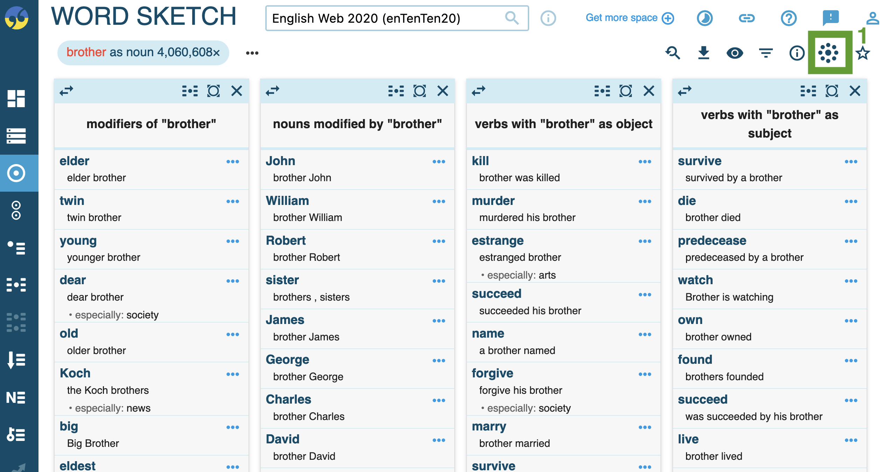

- studying variation in frequency of use
	- background of [[Hilpert2023Meaning]]
	  collapsed:: true
		- ((645a1add-5577-41b5-a719-4379a3fc72d5))
		- abstract
			- {{embed ((645a1b9e-f78b-46c6-a43e-262f285a67d2))}}
	- practice
	  collapsed:: true
		- {{embed ((645a1aa2-28a7-41f4-bf64-bc8afce0bfa4))}}
- studying variation in [[meaning]]
	- theoretical background on [[collocations]]
		- constructions
		  collapsed:: true
			- {{embed ((f67743f8-3c70-475b-993b-1f2eb4bc9a2f))}}
		- collocation
		  collapsed:: true
			- {{embed ((643e7a15-ed51-442c-876c-b0e501e8a7c1))}}
		- distributional hypothesis
		  collapsed:: true
			- ((6447a7c9-0293-435b-8944-d989642d2fe4))
		- the EC model account
		  collapsed:: true
			- ((64b64be5-125d-4878-bff7-43b9cf505a92))
		- example: differences between *cardio-vascular* and *cardio*
		  collapsed:: true
			- {{embed ((645a2b02-c578-4edc-b121-f5bca5a76389))}}
		- background on [[Hilpert2023Meaning]]
		  collapsed:: true
			- theoretical framework
			  collapsed:: true
				- {{embed ((661fc638-8ee3-4c63-8252-94500d90d702))}}
			- data
			  collapsed:: true
				- {{embed ((661fc638-c87c-43dd-99f7-43f003242132))}}
			- results
			  collapsed:: true
				- {{embed ((661fc638-a344-424e-887f-9d8dd21a6b23))}}
	- [[practice]]: studying semantics using collocations and [[word sketches]] in [[enTenTen20]] corpus on  [[Sketch Engine]]
		- [[collocations]]
		  collapsed:: true
			- run query to retrieve all occurrences and get concordance view (e.g. `[word="brother"]`)
				- {:height 246, :width 630}
			- click on collocation analysis icon (see green rectangle [above](((646c7cfa-b90e-4b49-8cf4-c78f8e81c272))))
			- run collocation analysis
				- 
					- ==1==: context window range to be considered: how many words to the left and right of the target word
					- ==2==: statistical measures to be used
			- results
				- 
					- ==1==: statistical measures (see [above](((646c7ffc-2a9c-4ee8-932c-5f9147e4823f))))
		- [[word sketches]]
		  collapsed:: true
			- for single forms (e.g. *bro*)
				- {:height 427, :width 652}
					- ==1==: word class
				- results
					- syntactic contexts
						- 
							- ==1==: visualise results
					- visualisation (using [button](((646c8116-7ad7-48a1-960d-15d7a6ec922b))))
						- 
			- word sketch comparison: source words (e.g. *brother*) vs clipped form (e.g. *bro*)
				- run comparison
					- 
						- ==1==: word class
				- results
					- 
				- inspect [[collocations]]
					- 
					- results
						- 
							- → [[homonymy]] with chemical term *BrO*, which stands for [Hypobromite](https://en.wikipedia.org/wiki/Hypobromite)
		- further information: see ((61964467-2068-4ed7-bf8c-a0f00fa5293e))
		- take notes for your target lexemes in the [Google Doc]([[Google Docs]]) [here](https://docs.google.com/document/d/1CGxqohsOlfiJp8AWaePwUC-xYvDr6Cscf1Q1Mi-uwuI/edit?usp=sharing) (short URL: https://shorturl.at/nuBM9)
		  collapsed:: true
			- What is the general semantic signature of the source words and clipped forms?
			- In how far do they differ semantically? (e.g. stylistic or social characteristics)
	- conclusion by [[Hilpert2023Meaning]]
	  collapsed:: true
		- ((646c7ffd-f579-4778-a862-f26364baf6ec))