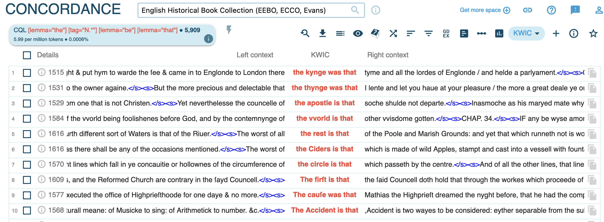
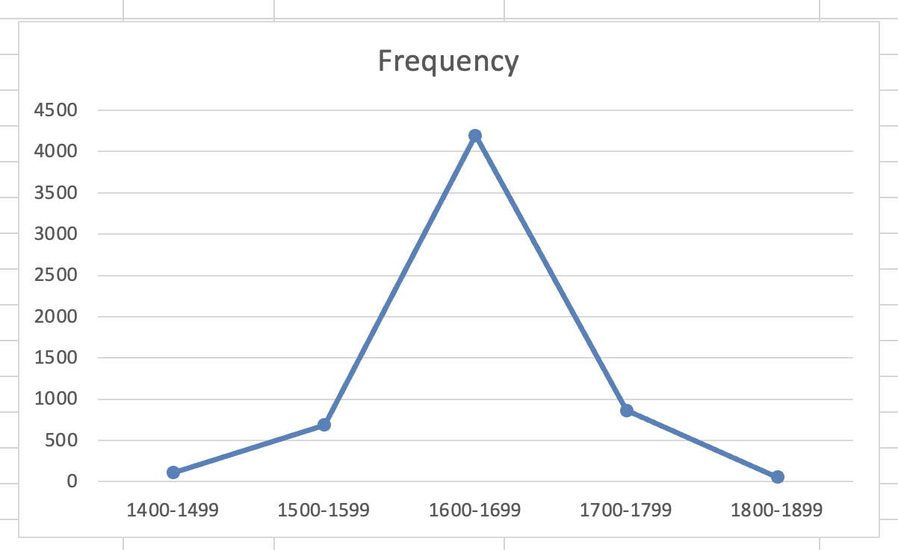
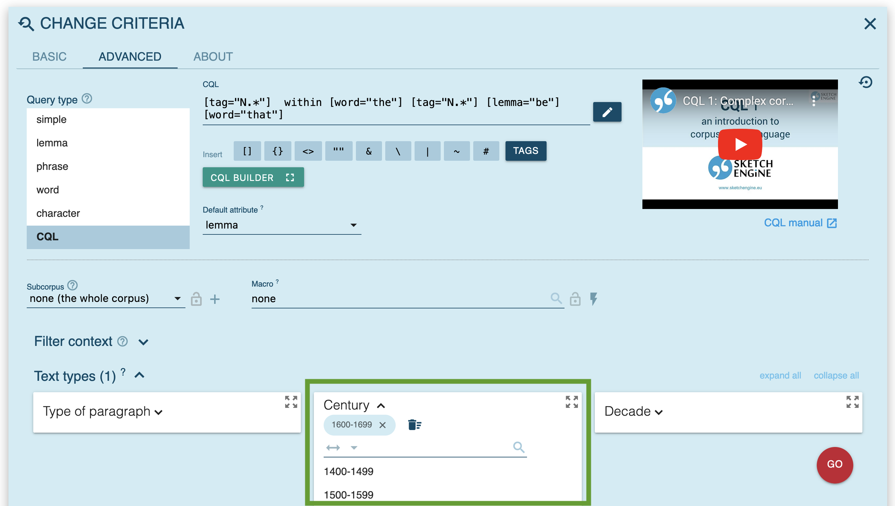

# clippings
collapsed:: true
	- ## frequency-based analysis
	  collapsed:: true
		- {{embed ((6463603a-25b8-468a-abff-524a6c75fe4f))}}
	- ## semantic analysis
	  collapsed:: true
		- {{embed ((1e44dc00-0557-4672-9187-6986cf52b3e7))}}
- # syntax:`the N BE that`
	- ## [[theoretical framework]]: ([[Schmid2015Entrenchment]])
		- ### abstract
		  collapsed:: true
			- ((646c8707-eff6-415a-aeef-ecde49f26c76))
		- ### EC-Model
		  collapsed:: true
			- {{embed ((6447aec5-f6ed-4fc0-99e4-23a9d1ea761f))}}
		- ### the construction
		  collapsed:: true
			- {{embed ((646c88dc-74b3-4967-9c65-677007940e4d))}}
		- ### data
		  collapsed:: true
			- {{embed ((646c8878-fbbe-4f50-880c-b764b77f3330))}}
		- ### results
		  collapsed:: true
			- frequency
			  collapsed:: true
				- {{embed ((646c8a01-f035-4b66-8d80-df92ce4de28c))}}
			- semantic change
				- {{embed ((646c9bdd-a595-46b1-a2c5-58d66fcb592b))}}
	- [[practice]]: corpus study
		- using the [[English Historical Book Collection (EEBO, ECCO, Evans)]] in [[Sketch Engine]]
		  id:: 646c8de9-6e1a-4e34-a604-12ad00520bf6
			- query for the construction and get a [[concordance]] view
			  collapsed:: true
				- 
			- [[frequency]] analysis
			  collapsed:: true
				- determine the frequency of the construction in the corpus
				  collapsed:: true
					- 
						- [absolute]([[frequency/absolute]]) frequency (`Frequency`): 5,909 tokens
						  id:: 646c8cde-e494-4239-97ac-70c001eae31a
						- [relative]([[frequency/relative]]) frequency (`Relative in text type`, pmw: per million words): 5.99 occurrences per million tokens/words (pmw)
						  id:: 646c8ce6-ea3b-49f6-935c-5f1695699d7e
				- investigate the [[diachronic]] frequency of the construction over time (by `Century`)
				  collapsed:: true
					- within Sketch Engine
					  collapsed:: true
						- 
					- using [[Microsoft Excel]]
						- Excel file: [the-n-be-that-diac.xlsx](../assets/the-n-be-that-diac_1686051292988_0.xlsx)
						- export the results in Excel format (`.xlsx` file type)
						  collapsed:: true
							- 
						- make a table
						  collapsed:: true
							- 
						- make line charts for
						  collapsed:: true
							- ((646c8cde-e494-4239-97ac-70c001eae31a))
							  collapsed:: true
								- 
							- ((646c8ce6-ea3b-49f6-935c-5f1695699d7e))
							  collapsed:: true
								- 
			- query specifically for the noun in the construction using [[CQL]] (hint: use the operator `within` preceding the construction)
			  id:: 646c8ab7-3d11-43d3-89d7-00d7944ebe60
				- identify the most frequent nouns used in the construction
				  collapsed:: true
					- 
					- 
					- 
				- analyse whether the most frequent nouns have changed over time (hint: do separate searches based on different values for `Text Type` / `Century`)
					- 
					- 
	- [[homework]]: read [[Schmid2015Entrenchment]]