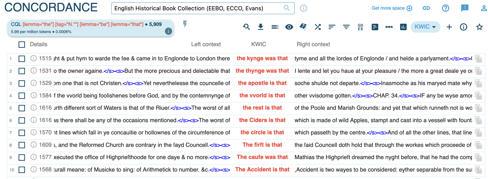
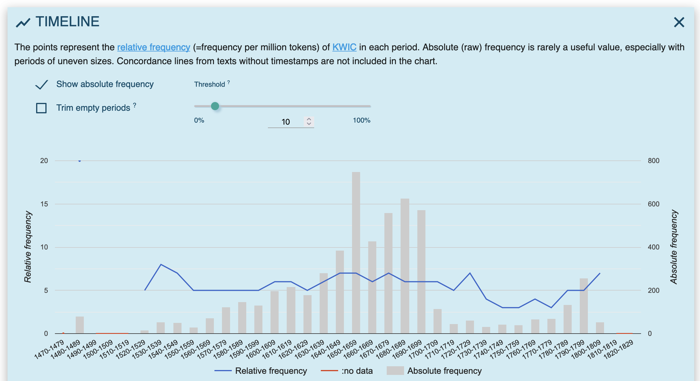
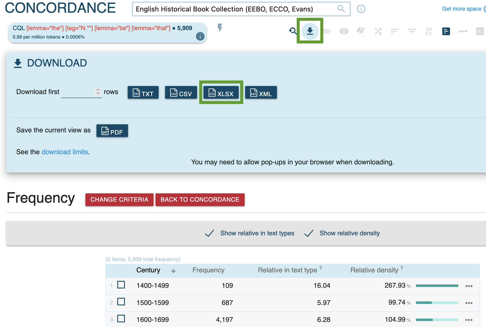
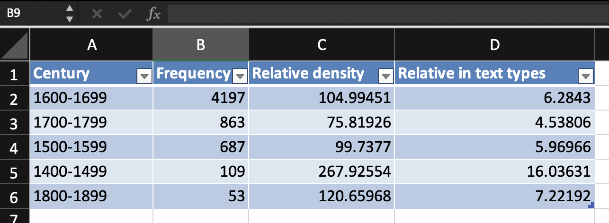
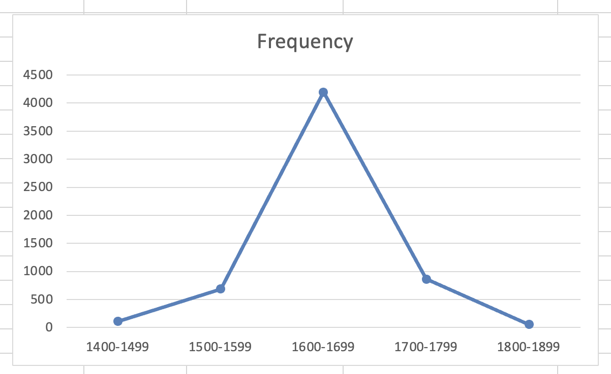
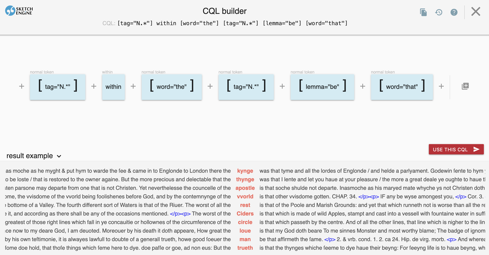
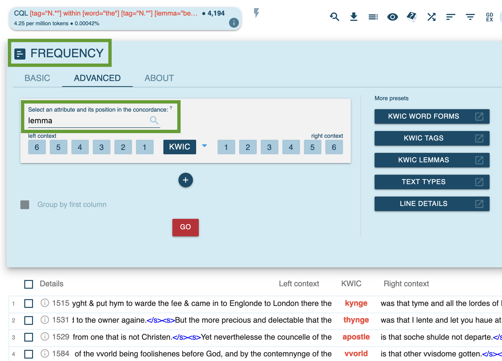
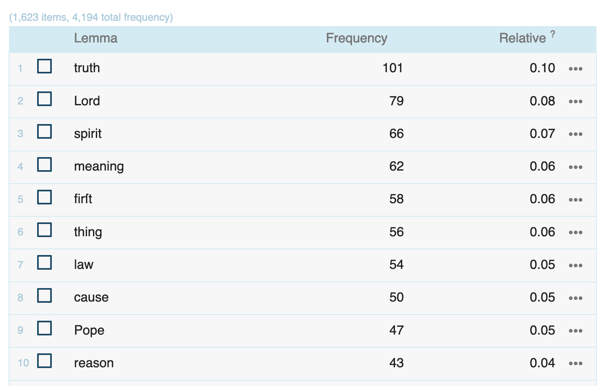
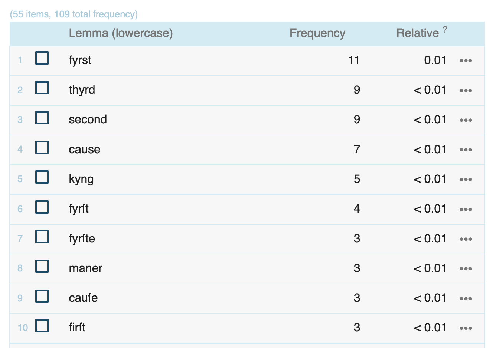
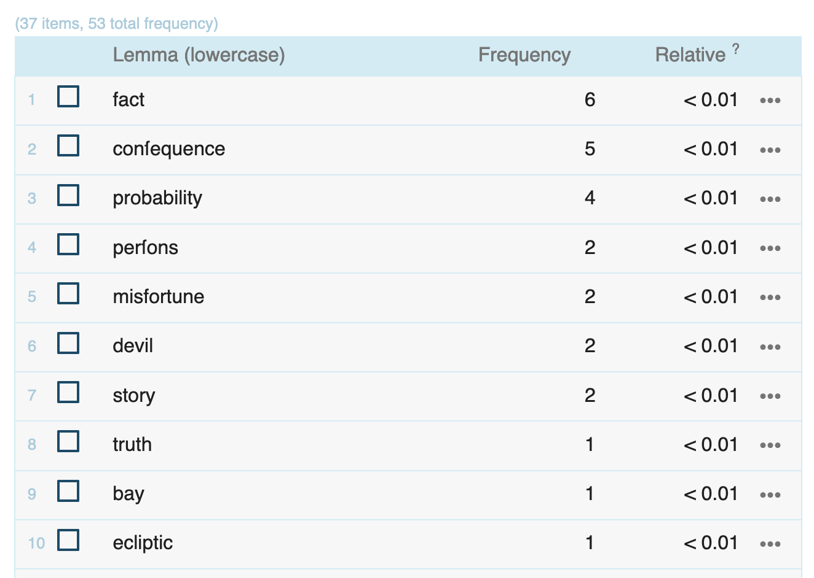

- [[theoretical framework]]: ([[Schmid2015Entrenchment]])
	- abstract
	  collapsed:: true
		- {{embed ((661fc639-3d08-4e66-b532-c148f3dd1a98))}}
	- EC-Model
	  collapsed:: true
		- {{embed ((6447aec5-f6ed-4fc0-99e4-23a9d1ea761f))}}
	- the construction
	  collapsed:: true
		- {{embed ((646c88dc-74b3-4967-9c65-677007940e4d))}}
	- data
	  collapsed:: true
		- {{embed ((646c8878-fbbe-4f50-880c-b764b77f3330))}}
	- results
	  collapsed:: true
		- frequency
		  collapsed:: true
			- {{embed ((646c8a01-f035-4b66-8d80-df92ce4de28c))}}
		- semantic change
		  collapsed:: true
			- {{embed ((646c9bdd-a595-46b1-a2c5-58d66fcb592b))}}
- [[practice]]: corpus study
	- using the [[English Historical Book Collection (EEBO, ECCO, Evans)]] in [[Sketch Engine]]
	  id:: 646c8de9-6e1a-4e34-a604-12ad00520bf6
		- query for the construction and get a [[concordance]] view
		  collapsed:: true
			- 
		- [[frequency]] analysis
		  collapsed:: true
			- determine the frequency of the construction in the corpus
			  collapsed:: true
				- 
				  collapsed:: true
					- [absolute]([[frequency/absolute]]) frequency (`Frequency`): 5,909 tokens
					  id:: 646c8cde-e494-4239-97ac-70c001eae31a
					  collapsed:: true
					- [relative]([[frequency/relative]]) frequency (`Relative in text type`, pmw: per million words): 5.99 occurrences per million tokens/words (pmw)
					  id:: 646c8ce6-ea3b-49f6-935c-5f1695699d7e
					  collapsed:: true
			- investigate the [[diachronic]] frequency of the construction over time (by `Century`)
			  collapsed:: true
				- within Sketch Engine
				  collapsed:: true
					- grouped by text type `Century`
					  collapsed:: true
						- 
					- timeline by `Decade`
					  collapsed:: true
						- 
				- using [[Microsoft Excel]]
				  collapsed:: true
					- Excel file: https://1drv.ms/x/s!AvkgNVl9yS6aokO4dB_h1_DiXKmw
					- export the results in Excel format (`.xlsx` file type)
					  collapsed:: true
						- 
					- make a table
					  collapsed:: true
						- 
					- make line charts for
					  collapsed:: true
						- ((646c8cde-e494-4239-97ac-70c001eae31a))
						  collapsed:: true
							- 
						- ((646c8ce6-ea3b-49f6-935c-5f1695699d7e))
						  collapsed:: true
							- 
		- query specifically for the noun in the construction using [[CQL]] (hint: use the operator `within` preceding the construction)
		  id:: 646c8ab7-3d11-43d3-89d7-00d7944ebe60
		  collapsed:: true
			- identify the most frequent nouns used in the construction
			  collapsed:: true
				- 
				- 
				- 
			- analyse whether the most frequent nouns have changed over time (hint: do separate searches based on different values for `Text Type` / `Century`)
			  collapsed:: true
				- 
				- 1400–1499
				  collapsed:: true
					- 
				- 1800–1899
				  collapsed:: true
					- 