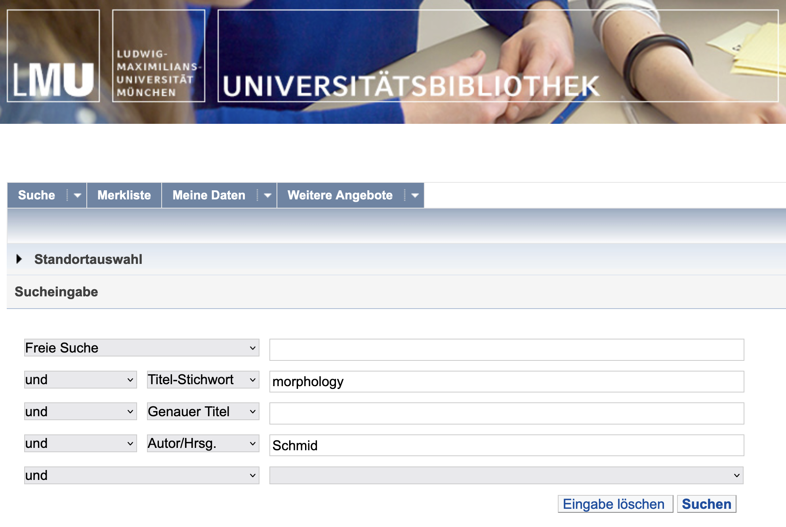
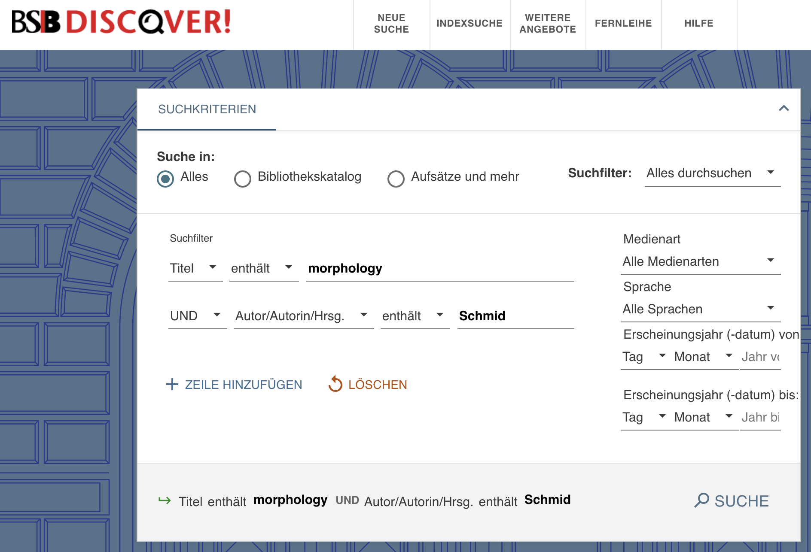

- assessment
	- requirements
	  collapsed:: true
		- {{embed ((661fc639-7261-4ae1-bdcb-379819743a7d))}}
	- Thesenpapier
	  collapsed:: true
		- {{embed [[Thesenpapier]]}}
	- Hausarbeit
	  collapsed:: true
		- {{embed [[Hausarbeit]]}}
- [[term paper consulting]]
  id:: 661fc638-7b25-4276-9ece-6b15824d186b
	- dates
		- Tue, 30. July
			- 10:00
		- Thu, 1. August
			- 14:00
		- Tue, 6. August
			- 14:00
		- Thu, 8. August
			- 10:00
	- registration: beforehand via mail
	- information required before: one day before the meeting via email
		- research questions and hypotheses
		- data and method
		- (abstract)
		- table of contents
		- bibliography
	- Zoom meeting
		- https://lmu-munich.zoom.us/j/5385530182?pwd=SE5iZDJGQlZ1V3dpN2Q4NW45WjF5Zz09
		- Meeting ID: 538 553 0182
		- Passcode: 531379
- [[term papers]] and research projects
	- goal
	  collapsed:: true
		- research question with a linguistic focus
		  collapsed:: true
			- collapsed:: true
			  + hypotheses
				- + why? (link to previous work)
		- empirical study
		- using corpus data
		- using corpuslinguistic methods
	- [[topic]]
	  collapsed:: true
		- What is a topic?
		  collapsed:: true
			- a more general account of what your are interested in
			- a vague formulation of your project
			- the area and discipline you are working in
		- What is a good topic?
		  collapsed:: true
			- is not too general but also not too specific
			- should have further relevance for linguistics
			- includes new aspects based on state of the art in the relevant theories
			- interesting and doable
			- is based on previous knowledge and/or observations
			- allows for a number of research questions
	- [[title]]
	  collapsed:: true
		- is the business card of your paper/thesis
		- must be informative and explicit
		- must have a reasonable link to the content
		- must not raise expectations that are not met in the paper
		- it’s often good to use a subtitle
	- research questions and hypotheses
	  id:: 661fc638-0129-4309-88fc-5ba4957fb61e
	  collapsed:: true
		- how to find RQs
		  collapsed:: true
			- from previous literature
			  collapsed:: true
				- by coming across a suggestion for desiderata / unanswered questions
				- by replicating someone else's work
				- by identifying a gap, i.e. something that has not yet been asked
			- from observation
			- from own empirical findings within the study
		- Which [[topic]] do I want to work on?
		  collapsed:: true
			- Is it broad enough to be interesting?
			- Is it narrow enough to be doable?
			- Does it have a strong enough linguistic focus?
		- Which [[research question]] do I want to work on?
		  collapsed:: true
			- Is it broad enough to be interesting?
			- Is it narrow enough to be doable?
			- Does it have a strong enough linguistic focus?
		- What are my [hypotheses]([[hypotheses]])?
		  collapsed:: true
			- What do I expect the outcome of my study to be?
			- Why do I expect these results? (e.g. previous studies, theoretical models)
		- How does my research question relate to [previous work]([[references]])?
		  collapsed:: true
			- Has there been previous work on this? From which fields?
			- Where lies the contribution of my project?
		- Which [data]([[data]]) could I use to study my research question?
		- Which [methods]([[methods]]) could I use to test my hypotheses?
	- references
	  collapsed:: true
		- finding references
		  collapsed:: true
			- libraries
			  collapsed:: true
				- LMU
				  collapsed:: true
					- [OPAC](https://www.ub.uni-muenchen.de/suchen/online-katalog/index.html)
					  collapsed:: true
						- 
					- [databases](https://www.ub.uni-muenchen.de/suchen/datenbanken/index.html)
					  collapsed:: true
						- ==Linguistics and Language Behavior Abstracts (LLBA)==: This database focuses on abstracts from approximately 2,000 journals dedicated to the study of linguistics and related disciplines. It also provides summaries of books, book chapters, dissertations, and conference papers.
						- ==MLA International Bibliography==: Produced by the Modern Language Association, this database includes citations from journals, books, and dissertations focused on literature, language, linguistics, and folklore.
						- ==JSTOR==: JSTOR is a multidisciplinary digital library containing a large amount of academic content. Its linguistics section includes a range of resources from academic journals, books, and primary sources.
						- ==ProQuest==: ProQuest is a multidisciplinary research database, providing a variety of resources, including magazines, journals, newspapers, and more. It contains a wide range of materials in the field of linguistics.
						- ==ScienceDirect==: ScienceDirect, from Elsevier, provides full text access to over 2,500 journals and 11,000 books. It includes plenty of resources related to linguistics.
						- ==John Benjamins e-Platform==: This platform provides a broad range of material across various linguistic sub-disciplines. It's particularly known for its publications in theoretical and functional linguistics, psycholinguistics, and semantics.
						- ==Oxford University Press Journals==: Oxford University Press publishes several important and prestigious journals in the field of linguistics.
						- ==Cambridge Core==: This is the place to find a range of linguistics journals published by Cambridge University Press, which covers all aspects of the study of language, from phonetics, phonology and syntax, to sociolinguistics and psycholinguistics.
						- ==Wiley Online Library==: Wiley publishes a range of peer-reviewed journals in the field of linguistics, including cognitive linguistics, sociolinguistics, and applied linguistics.
						- ==Ethnologue==: While not a traditional academic database, Ethnologue is a comprehensive reference work cataloging all of the world's known living languages. It's very useful for linguistic ethnography and studies of language diversity.
				- Bayerische Staatsbibliothek (BSB)
				  collapsed:: true
					- [OPAC](https://opacplus.bsb-muenchen.de/metaopac/start.do)
					  collapsed:: true
						- 
			- web
			  collapsed:: true
				- [Google Scholar](https://scholar.google.com/)
				- [OpenAlex](https://alpha.openalex.org/works)
				  collapsed:: true
					- [[open source]] alternative to Google Scholar
				- [Semantic Scholar](https://www.semanticscholar.org/me/research)
				- [Connected Papers](https://www.connectedpapers.com/)
				  collapsed:: true
					- 
			- ‘dark’ web
			  collapsed:: true
				- I can't recommend using these platforms ...
				  collapsed:: true
					- LibGen
					- SciHub
			- research network platforms
			  collapsed:: true
				- [academia.edu](https://www.academia.edu/)
				- [ResearchGate](https://www.researchgate.net/)
			- ‘Schneeballprinzip’
			  collapsed:: true
				- Find a good, (recent) relevant reference to a topic.
				  collapsed:: true
					- Often handbooks provide a high-quality, dense overview.
				- Check its references.
				- Check the references’ references.
			- [[AI]]-assisted services
			  collapsed:: true
				- [elicit.org](https://elicit.org/)
				  collapsed:: true
					- {:height 335, :width 629}
		- citing references
		  collapsed:: true
			- guides
			  collapsed:: true
				- [Stilblatt](https://www.anglistik.uni-muenchen.de/service_downloads/allgemeine_handouts/stilblatt.pdf) Anglistik LMU
				  id:: ebb0f4e9-79ea-45cf-ab72-66f9a22b9276
				  collapsed:: true
				- [Chicago Author-Date Style](https://www.chicagomanualofstyle.org/tools_citationguide/citation-guide-2.html)
				  id:: e7fd4c4a-1665-4c1a-909a-21ef90ebe186
				  collapsed:: true
				- [Unified Style Sheet for Linguistics](https://www.linguisticsociety.org/resource/unified-style-sheet)
				  id:: 6625d898-422c-4675-8191-7d57b9a40929
				  collapsed:: true
				- [APA](https://libguides.murdoch.edu.au/APA)
			- in-text citations
			  collapsed:: true
				- usually you should use an author-date format
				  collapsed:: true
					- e.g. “Here’s an interesting quote.” (Schmid 2020: 420)
					- recommended styles
					  collapsed:: true
						- ((ebb0f4e9-79ea-45cf-ab72-66f9a22b9276))
						- ((e7fd4c4a-1665-4c1a-909a-21ef90ebe186))
						- ((6625d898-422c-4675-8191-7d57b9a40929))
			- bibliography
			  collapsed:: true
				- needs to be consistent
				- needs to follow one of the style guides recommended above
				- must only contain sources you have cited in your paper
		- managing references
		  collapsed:: true
			- manually
			  collapsed:: true
				- recommendation: maintain **1** file with all your bibliographic information
			- using tools
			  collapsed:: true
				- my recommendation: [Zotero](https://www.zotero.org/)
				- other tools
				  collapsed:: true
					- [Citavi](https://citavi.com/)
					- [EndNote](https://endnote.com/)
					- [Mendeley](https://www.mendeley.com/)
	- structure
	  id:: 666b6a4e-af97-4e4b-8815-9f550ae55b06
		- Introduction
		  collapsed:: true
			- This section should provide an overview of the topic, the context, and the relevance of the research. It should also include the research question or hypothesis, and a brief summary of what the paper will cover.
		- Theoretical Background
		  collapsed:: true
			- This section should provide a detailed review of the existing literature relevant to your research question. It should highlight the theories and findings of previous studies, and how they relate to your own research. This section should also define any key terms and concepts.
		- Data
		  collapsed:: true
			- This section should describe the data that you will be analyzing in your study. This could include the source of the data, the criteria for selection, and any relevant characteristics of the data. In a corpus linguistic paper, this would typically involve describing the corpus that you are using.
		- Method
		  collapsed:: true
			- This section should describe the methods you used to analyze your data. This should include any specific techniques or procedures, as well as any software or tools used. In a corpus linguistic paper, this might involve describing how you used a particular software tool to analyze the frequency and distribution of certain linguistic features in your corpus.
		- Results
		  collapsed:: true
			- This section should present the findings of your analysis. It should be clear and concise, and use tables, graphs, or other visual aids where appropriate. The results should be presented in a way that directly addresses your research question or hypothesis.
		- Discussion
			- This section should interpret the results in the context of your research question and the existing literature. It should discuss whether the results support your hypothesis, and what implications they have for the field of linguistics. This section may also identify any limitations of your study, and suggest areas for future research.
		- Conclusion
			- This section should provide a summary of your research, the main findings, and the implications of these findings. It should also restate the relevance of your research and provide a final thought or reflection on the study.
	- style and readability
	  collapsed:: true
		- be concrete and explain
		- do not presuppose too much prior knowledge on the part of your reader
		- aim for a neutral – scientific – academic style
		- aim for understandable – precise – clear formulations
		- *I* vs *one* vs *we* vs *the author*
		- delete superfluous information – include necessary information
		- avoid long and complicated sentences
		- use topic sentences
		- use examples
		- put the main thing in the main clause
		- use full stops
		- avoid fillers
		- use active instead of passive
		- use verbs instead of nouns
	- tools for writing
	  collapsed:: true
		- dictionaries
		  collapsed:: true
			- [linguee](https://www.linguee.de/)
			- [dict](https://www.dict.cc/)
		- thesauri
		  collapsed:: true
			- [thesaurus.com](https://www.thesaurus.com/)
		- collocations
		  collapsed:: true
			- [ozdic.com](https://ozdic.com/)
			- [netspeak](https://netspeak.org)
		- spelling and grammar checking
		  collapsed:: true
			- [LanguageTool](https://languagetool.org/)
			  collapsed:: true
				- LanguageTool is a multilingual spelling, style, and grammar checker that helps correct or paraphrase texts. It offers a wide range of language support and can be integrated into various platforms like browsers, word processors, and email clients. LanguageTool is particularly useful for checking grammar and spelling in over 20 languages, and it also provides style and punctuation suggestions. However, as with any automated tool, it's important to review and understand the changes it suggests to ensure they align with your original intent and academic standards.
			- [Grammarly](https://www.grammarly.com/)
			  collapsed:: true
				- Grammarly is a widely-used digital writing assistant that helps you eliminate writing errors and find the perfect words to express yourself. It offers real-time grammar, spelling, and punctuation checks, along with style improvements to ensure your writing is clear and engaging. Grammarly also provides detailed explanations for all your mistakes and weekly progress reports to help you understand your strengths and areas for improvement. It's a great tool for academic writing, but remember to review its suggestions to ensure they fit the context of your work.
		- [[AI]]-based tools
		  collapsed:: true
			- [DeepLWrite](https://www.deepl.com/write)
			- [ChatGPT](https://openai.com/chatgpt)
			  collapsed:: true
- corpuslinguistic topics and research questions
	- theoretical frameworks
		- [[usage-based approach]]
			- ((64b64be4-4051-4d23-9ab2-09df197976f2))
		- [[S-curve model]]
			- {{embed ((6447af61-6674-4374-9bab-a132f1af0f01))}}
		- [[EC-Model]]
			- {{embed ((64b64be5-125d-4878-bff7-43b9cf505a92))}}
		- [corpus-as-input and corpus-as-output]([[frequency]] as an indicator for [[entrenchment]] and [conventionality]([[conventionalization]]) ([[Stefanowitsch2017Corpusbased]]))
			- [[frequency]] as an indicator for [[entrenchment]] and [conventionality]([[conventionalization]]) ([[Stefanowitsch2017Corpusbased]])
		- register and [[text type/variation]]
			- ((6488482e-0fd9-49cd-b1b4-56aadf272178))
			  id:: 661fc638-15e4-4217-834f-38e23add6b49
		- [[distributional hypothesis]]
			- ((645a20e9-f7b0-478b-bd31-d1fa07fdd451))
	- research topics and questions
		- broad research foci
			- [[linguistic variation]]
				- overview
					- ((64b64be4-a025-4059-8481-82fb9c41f002))
				- [[speaker variation]]
					- ((647f0734-ac35-4b68-bf52-0cc558e7b4cc))
				- [[text type/variation]]
					- [[lexis]]: *blockchain*
						- ((64b64be4-92a2-45aa-a795-5c79e22375dd))
					- modal verbs
					  id:: 661fc638-224d-44fc-8632-1a2d19e1a466
						- 
				- [[geographical variation]]
				  id:: 661fc638-b213-4242-9a6e-2cac63f63f34
					- frequency by country in the [[NOW corpus]]
						- `fall_nn`
							- 
						- `autumn_nn`
							- 
			- [[language change]]
				- 
				  id:: 666b6d44-7960-4bba-b13f-287e547fab8f
		- domains of language
			- [[lexis]]
				- [[neologisms]]
					- ((64b64be4-1988-49fa-b124-e67e4ea3c00e))
				- [[clippings]]
					- 
			- [[morphology and word-formation]]
				- {{embed ((64b64be4-310c-429c-bc18-9975c6721409))}}
				- ((645a24aa-aa0c-4e46-87c3-3afc287b2a9a))
			- [[syntax]]
				- `the N BE that` ([[Schmid2015Entrenchment]])
					- ((646c88e8-8923-4244-8457-d4791a56e7a0))
					- ((64b64be5-52fd-4eb6-8a40-85d03b955b62))
				- modal verbs
					- 
			- [[semantics]]
				- ((64b64be4-745d-488a-8e25-9f1f88b74ae1))
	- data and corpora
		- [[Sketch Engine]]
			- [[Gutenberg English 2020]]
			- [[EEBO]]
			- [[enTenTen20]]
			- [[English Trends (2014–today)]]
		- [[english-corpora.org]]
			- [[COHA]]
			- [[COCA]]
			- [[NOW]]
	- methods
		- [[frequency]]
		- [[collocations]]
		- [[word sketches]]
	- further examples and case studies: see [[Stefanowitsch2020Corpus]]
	- further reading
		- {{embed ((64b64be4-0efc-441d-aec2-f093845df874))}}