- [[Tottie2006Tag]]
	- ((66743b4a-0631-4f73-928e-f37204d17412))
	- abstract
	  id:: 66743c46-4092-4f99-965f-001518f16544
		- ((66743bad-8bda-4920-b1d4-1636687d2a2e))
	- questions
	  collapsed:: true
		- How do the authors connect their work to theoretical models, linguistic concepts, and previous work?
		  logseq.order-list-type:: number
		  collapsed:: true
		- Which types of question tags do they study?
		  logseq.order-list-type:: number
		  collapsed:: true
		- Which kinds of variation in the use of question tags do they observe?
		  logseq.order-list-type:: number
		  collapsed:: true
		- How could you replicate this study using Sketch Engine?
		  logseq.order-list-type:: number
		  collapsed:: true
		- Are there limitations or directions for future work you could expand on?
		  logseq.order-list-type:: number
		  collapsed:: true
	- types of canonical question tags
	  collapsed:: true
		- examples
		  id:: 66743d58-c111-47c1-bd70-561e0a8bdde4
		  collapsed:: true
			- 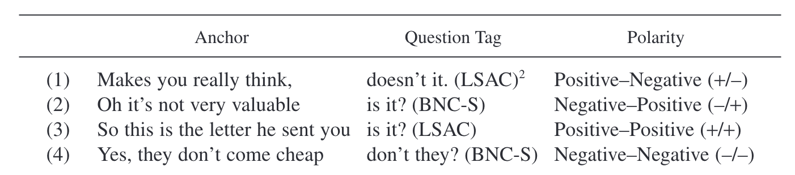
			  id:: 66743cb0-b919-40e1-8d37-b08f7be8ec84
			  collapsed:: true
		- syntactic structure
		  id:: 66743d1c-a704-49d7-844d-58bd2e17b9c4
		  collapsed:: true
			- This type of tag question consists of two clauses,
			  collapsed:: true
				- an anchor
				- and a tag.
			- The **subject**
			  collapsed:: true
				- in the anchor can be 
				  collapsed:: true
					- a full noun phrase,
					- a pronoun,
					- or *there*,
				- but in the tag, it must be either 
				  collapsed:: true
					- a personal pronoun,
					- *there*, or
					- *one*.
			- The **verb**
			  collapsed:: true
				- in the anchor can be 
				  collapsed:: true
					- a lexical verb,
					- an auxiliary,
					- or a modal verb;
				- the verb in the tag must be 
				  collapsed:: true
					- an auxiliary
					- or a modal.
		- polarity
		  collapsed:: true
			- There can be **reversed polarity** (positive–negative or negative–positive) in the anchor clause and the following question tag, as in (1) and (2);
			- **constant positive polarity**, as in (3);
			- or **constant negative polarity**, as in (4), a rare type whose existence has occasionally been questioned (see e.g., Quirk et al. 1985, 813) but of which we have found some genuine examples.”
	- constraints
	  collapsed:: true
		- preceding *wh*-words
		  collapsed:: true
			- “One constraint was to disallow instances with a wh-word (or a wh-word followed by a noun) immediately preceding the potential tag as in (6) and (7):
			  collapsed:: true
				- (6) Hello, how are you? (BNC-S)
				- (7) What number is it? (BNC-S)”
		- subsequent verbs
		  collapsed:: true
			- “Another constraint excluded sentences with a verb immediately following the pronoun, as in (8) and (9):
			  collapsed:: true
				- (8) Doesn’t he like the vet? (BNC-S)
				- (9) Hasn’t he improved? (BNC-S)”
		- subsequent adjectives
		  collapsed:: true
			- “A third constraint excluded examples containing an adjective immediately following the pronoun of the potential question tag, as in (10) and (11):
			  collapsed:: true
				- (10) Are they comfortable? (BNC-S)
				- (11) Are you happy to do it...?(BNC-S)”
	- random sample
	  collapsed:: true
		- “We therefore worked with a random subset of these, which yielded a total of 4,973 relevant instances. Frequency figures for BNC-S are therefore based on extrapolation rather than full manual counts. However, given the high number of relevant instances, we are confident that our results are valid.”
	- pragmatic functions
	  collapsed:: true
		- 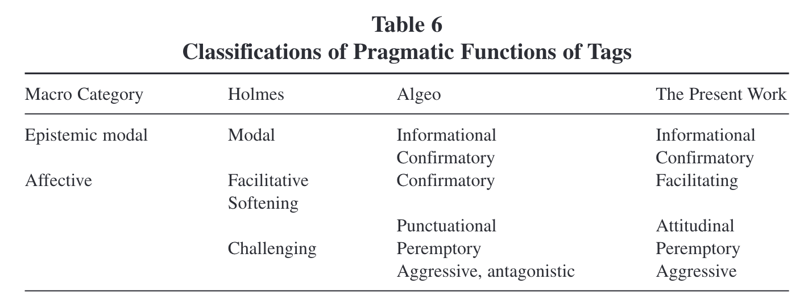
	- results
	  id:: 66743ed7-f87f-47be-a55f-6b4e1b3a931a
	  collapsed:: true
		- [[British English]] vs [[American English]]
		  id:: 667492a1-9cfb-4b25-a65c-45105a76f722
		  collapsed:: true
			- 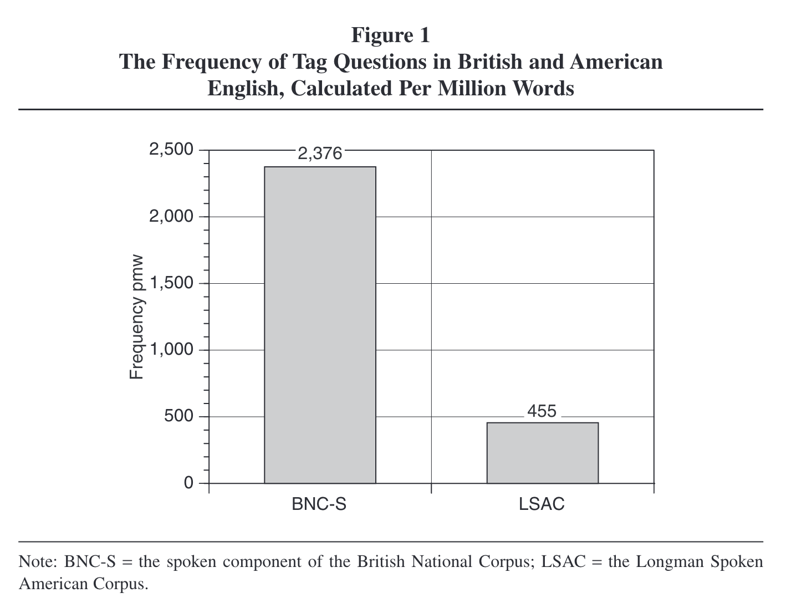
		- polarity
		  collapsed:: true
			- Based on two samples of 1,000 instances each, we found that positive–negative polarity tag constructions are indeed the most frequent choice in both varieties, accounting for 75 percent of the totals in British and 69 percent in American English.” (p. 289)
			- 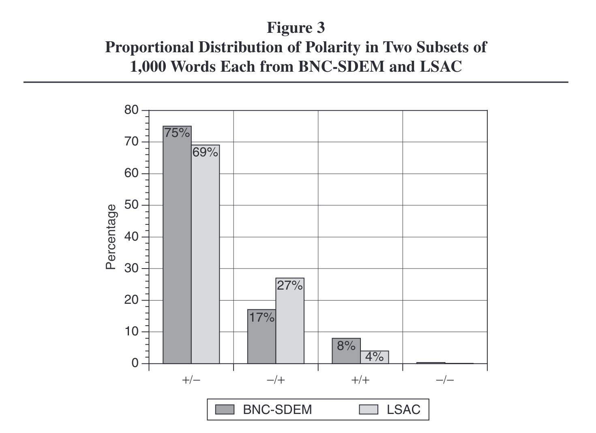
		- auxiliary use
		  collapsed:: true
			- 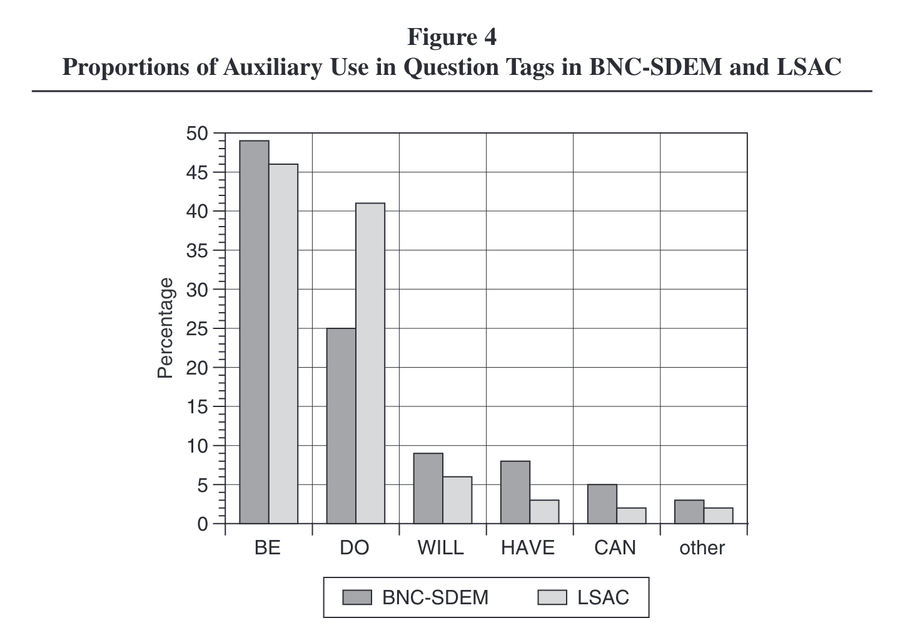
		- pronouns
		  collapsed:: true
			- 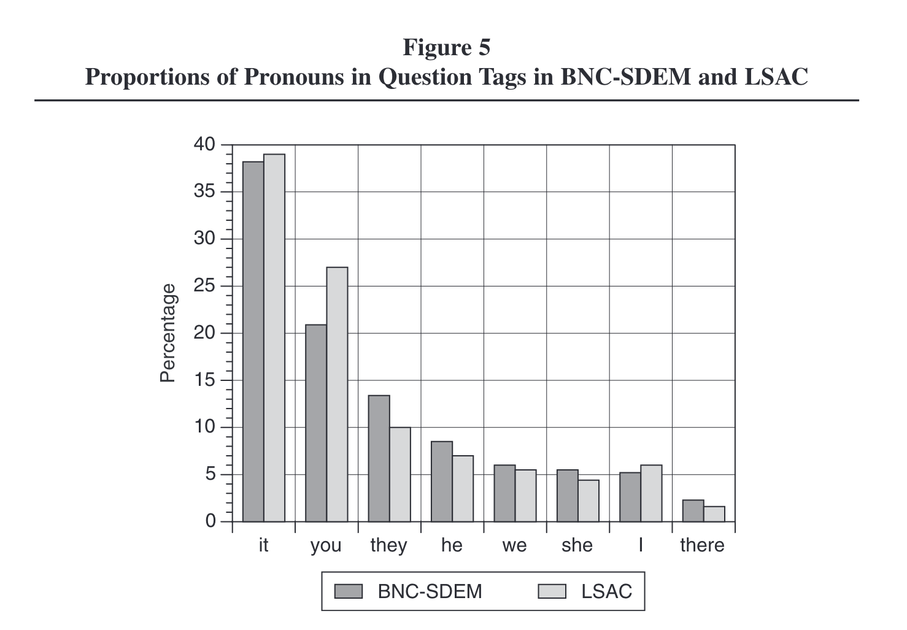
		- phrases
		  collapsed:: true
			- 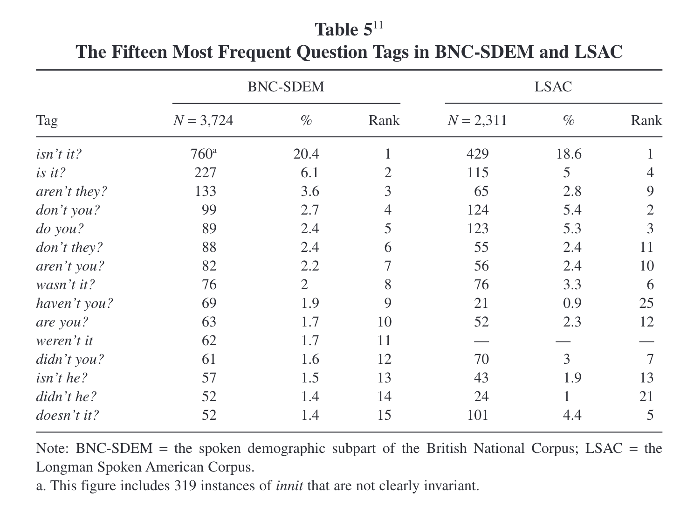
		- pragmatic functions
		  collapsed:: true
			- 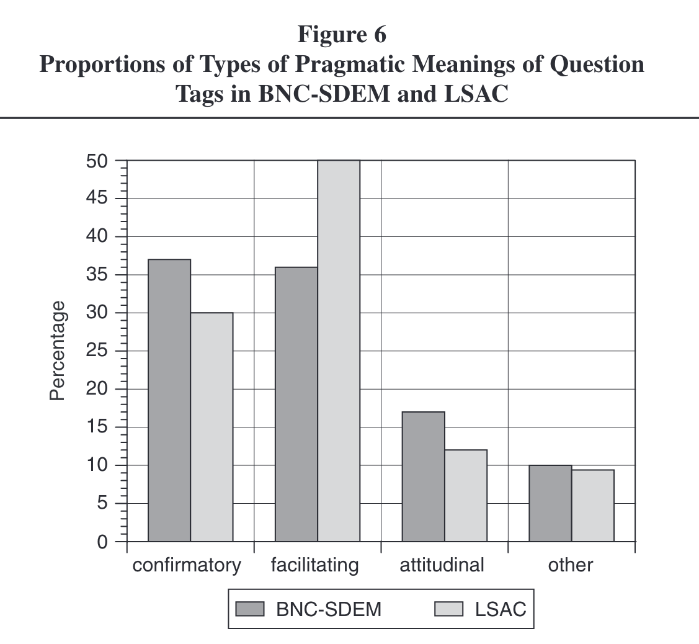
		- sociolinguistic variation
		  collapsed:: true
			- [[gender]]
			  collapsed:: true
				- 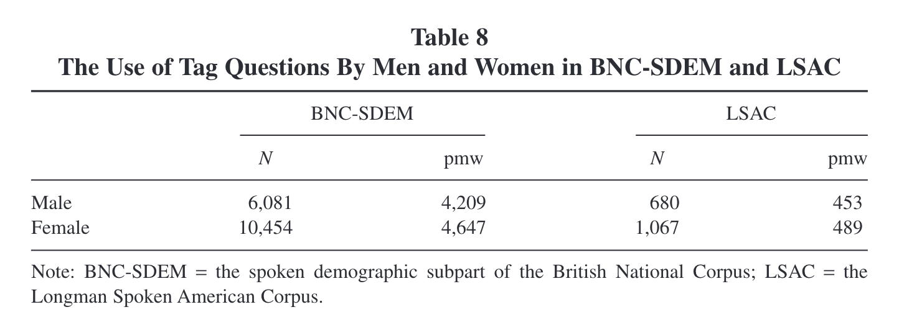
			- [[age]]
			  collapsed:: true
				- 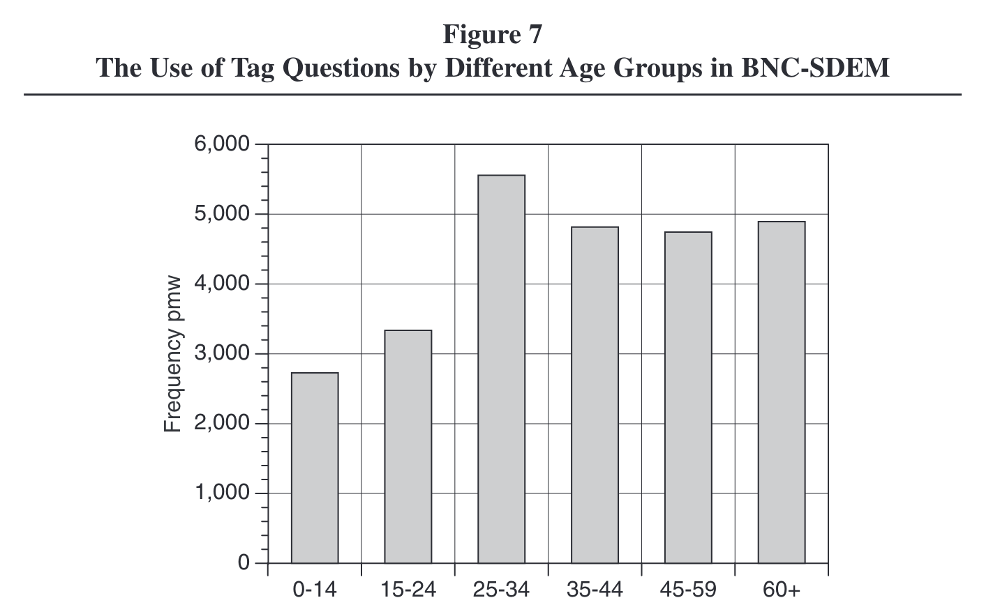
				- 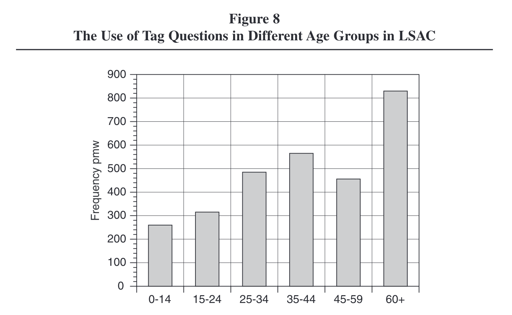
				- “It seems highly probable that what we see here is not a development toward fewer tags in younger people but a shift in the type of tags used by different age groups, a hypothesis that is at least partially supported by a preliminary study of British English by Serino (2006).” (p. 306)
- [[practice]]: study question tags in the [BNC 2014 Spoken]([[BNC/2014/spoken]]) using [[Sketch Engine]]
	- shared [[Microsoft Excel]] sheet: https://1drv.ms/x/s!AvkgNVl9yS6aokXQ2KHBstYsWunQ
	- retrieve attestations of question tags
	  id:: 66743b58-d38d-44b2-afb1-2ec6ae992520
		- create and refine a query to collect question tags
			- 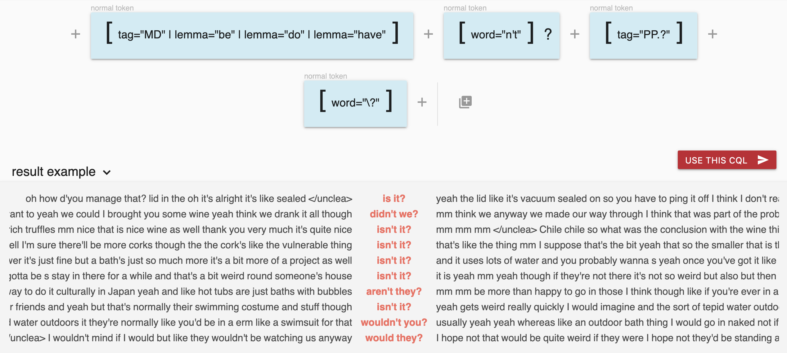
			  id:: 667497f7-8524-4e05-afa6-a508b375b9d6
			- `[tag="MD" | lemma="be" | lemma="do" | lemma="have"] [word="n't"]?  [tag="PP.?"] [word="\?"]`
			- https://ske.li/questiontagsbnc
		- evaluate false positive rate
			- use [[Sketch Engine]] download a [[random sample]] of 50 hits
			- use [[Microsoft Excel]] to annotate and analyse it
				- model sheet: https://1drv.ms/x/s!AvkgNVl9yS6aokmqDbTz5BmfbU6C
				- add a column named `Label`
				- annotate each attestation with
					- `0`: no question tag → false positive
					- `1`: question tag → true positive
				- think about how you could reduce false positives
					- either in SkE by refining your query
						- exclude instancest at utterances start
							- ```
							  <u> []{1,} 1:[tag="MD" | lemma="be" | lemma="do" | lemma="have"] [word="n't"]? [tag="PP.?"] [word="\?"] within <u/>
							  ```
						- exclude *wh*-words preceding the pattern (like *when* and *where*)
							- ```
							  <u> []{1,} [lemma!="where|who|which|when"] [tag="MD" | lemma="be" | lemma="do" | lemma="have"] [word="n't"]?  [tag="PP.?"] [word="\?"]  within <u/>
							  ```
					- or in Excel using filters (see model sheet)
				- analyse false positive rate
	- determine most frequent question tag forms
	  id:: 66744028-0f26-45cc-85c0-c1f3ba3a40cf
		- individual phrases (e.g. *is n't it* vs *are n't you*)
		- most frequent pronouns
		- most frequent verbs
			- `[tag="V.*" | tag="MD"]  within [tag="MD" | lemma="be" | lemma="do" | lemma="have"] [word="n't"]?  [tag="PP.?"] [word="\?"]`
			- https://ske.li/questiontagsverbs
	- analyse sociolinguistic variation (→ frequency by `Text Type`)
	  id:: 66744141-74a7-4634-9992-8da136218bf5
		- age: `Age range`
		- gender: `Gender`
		- social grade: `Class: Social grade`
			- [tag-questions_social-grade.xlsx](../assets/tag-questions_social-grade_1719870061287_0.xlsx)
			- [tag-questions_social-grade.xlsx](file://./assets/tag-questions_social-grade_1719870061287_0.xlsx)
		- education: `Highest qualification`
	- investigate polarity
	  id:: 66749324-127e-4a2b-93eb-de7f5e215130
		- ```
		  [tag="V.*"] [word="n't" | word="not"] []{1,} [tag="MD" | lemma="be" | lemma="do" | 
		  lemma="have"] [word="n't"]?  [tag="PP.?"] [word="\?"]  within <u/>
		  ```
		- https://ske.li/questiontagspolarity