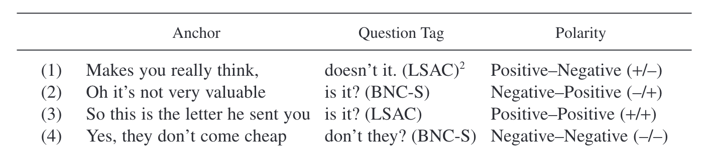
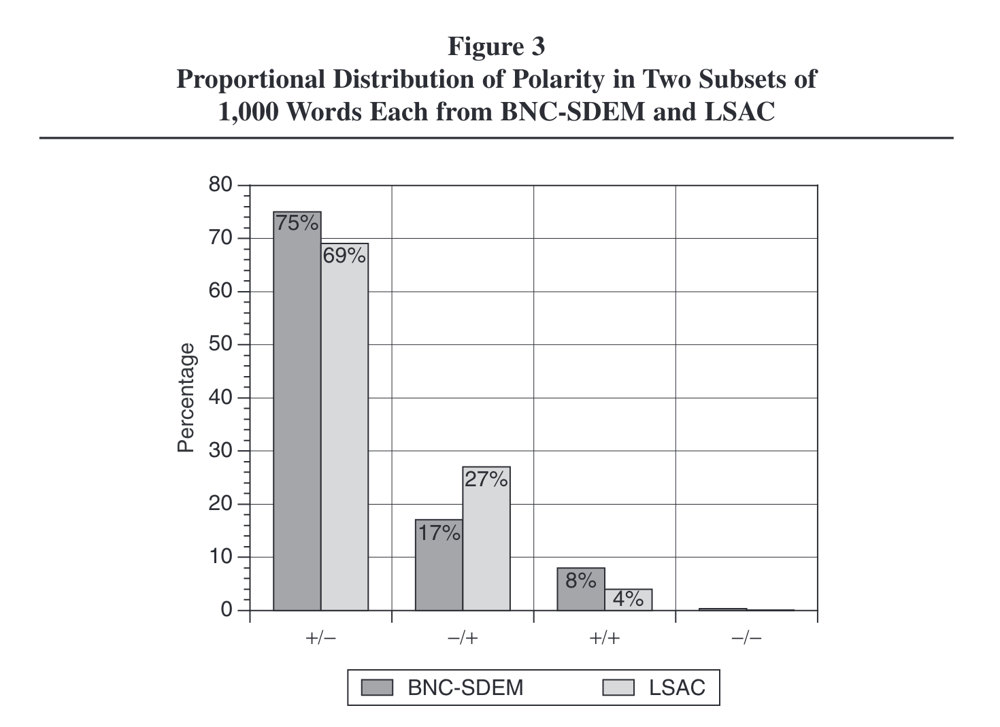
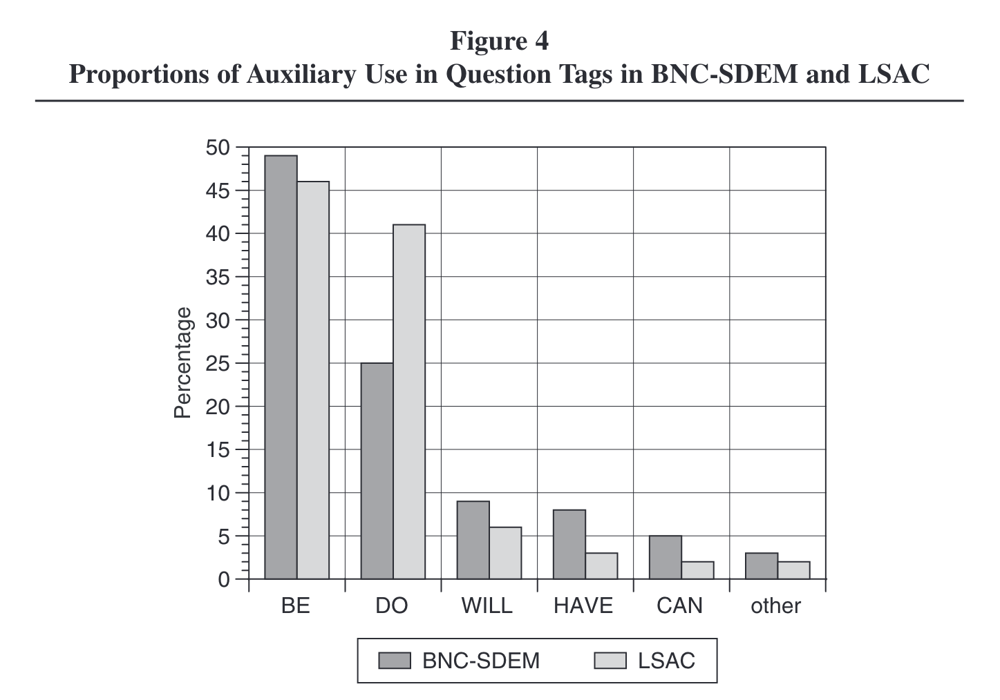
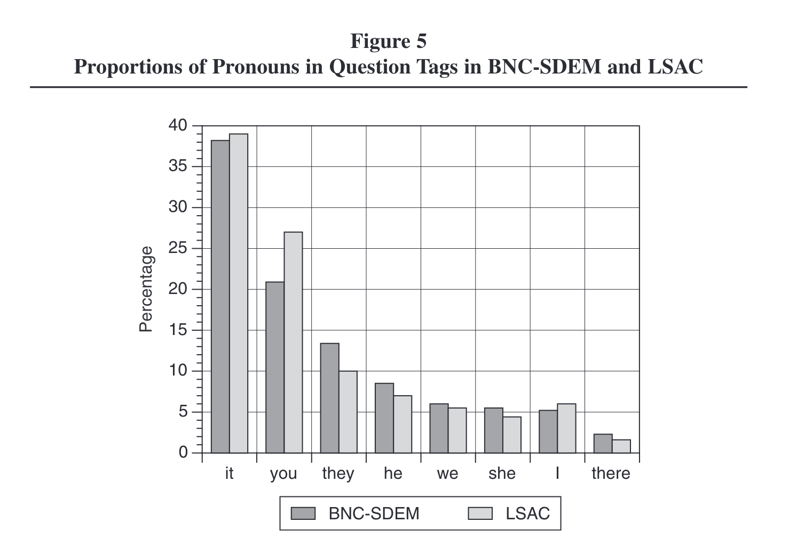
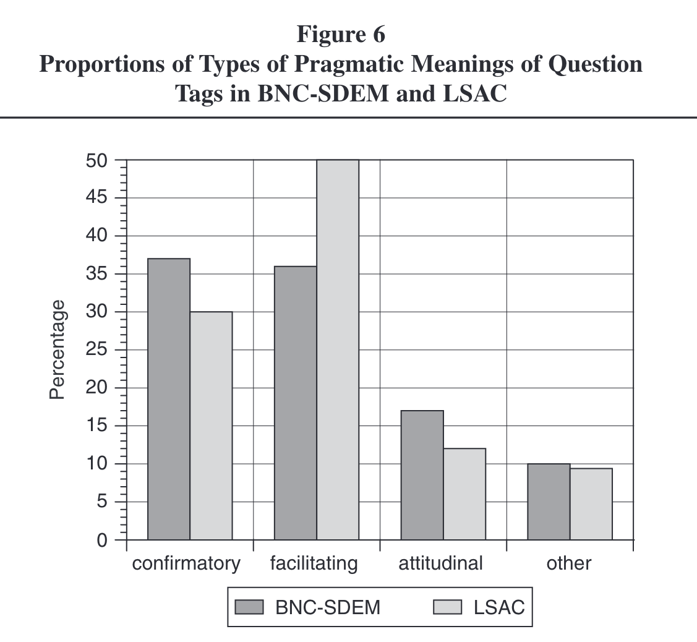

- [[Tottie2006Tag]]
	- ((66743b4a-0631-4f73-928e-f37204d17412))
	- abstract
	  collapsed:: true
		- ((66743bad-8bda-4920-b1d4-1636687d2a2e))
	- questions
	  collapsed:: true
		- How do the authors connect their work to theoretical models, linguistic concepts, and previous work?
		  logseq.order-list-type:: number
		- Which types of question tags do they study?
		  logseq.order-list-type:: number
		- Which kinds of variation in the use of question tags do they observe?
		  logseq.order-list-type:: number
		- How could you replicate this study using Sketch Engine?
		  logseq.order-list-type:: number
		- Are there limitations or directions for future work you could expand on?
		  logseq.order-list-type:: number
	- types of canonical question tags
		- examples
		  collapsed:: true
			- 
		- syntactic structure
		  collapsed:: true
			- This type of tag question consists of two clauses,
				- an anchor
				- and a tag.
			- The **subject**
				- in the anchor can be
					- a full noun phrase,
					- a pronoun, or *there*,
				- but in the tag, it must be either
					- a personal pronoun,
					- *there*, or
					- *one*.
			- The **verb**
				- in the anchor can be
					- a lexical verb,
					- an auxiliary,
					- or a modal verb;
				- the verb in the tag must be
					- an auxiliary
					- or a modal.
		- polarity
		  collapsed:: true
			- There can be **reversed polarity** (positive–negative or negative–positive) in the anchor clause and the following question tag, as in (1) and (2);
			- **constant positive polarity**, as in (3);
			- or **constant negative polarity**, as in (4), a rare type whose existence has occasionally been questioned (see e.g., Quirk et al. 1985, 813) but of which we have found some genuine examples.”
	- constraints
		- preceding *wh*-words
		  collapsed:: true
			- “One constraint was to disallow instances with a wh-word (or a wh-word followed by a noun) immediately preceding the potential tag as in (6) and (7):
				- (6) Hello, how are you? (BNC-S)
				- (7) What number is it? (BNC-S)”
		- subsequent verbs
		  collapsed:: true
			- “Another constraint excluded sentences with a verb immediately following the pronoun, as in (8) and (9):
				- (8) Doesn’t he like the vet? (BNC-S)
				- (9) Hasn’t he improved? (BNC-S)”
		- subsequent adjectives
		  collapsed:: true
			- “A third constraint excluded examples containing an adjective immediately following the pronoun of the potential question tag, as in (10) and (11):
				- (10) Are they comfortable? (BNC-S)
				- (11) Are you happy to do it...?(BNC-S)”
	- random sample
	  collapsed:: true
		- “We therefore worked with a random subset of these, which yielded a total of 4,973 relevant instances. Frequency figures for BNC-S are therefore based on extrapolation rather than full manual counts. However, given the high number of relevant instances, we are confident that our results are valid.”
	- pragmatic functions
	  collapsed:: true
		- 
	- results
		- [[British English]] vs [[American English]]
		  collapsed:: true
			- 
		- polarity
		  collapsed:: true
			- Based on two samples of 1,000 instances each, we found that positive–negative polarity tag constructions are indeed the most frequent choice in both varieties, accounting for 75 percent of the totals in British and 69 percent in American English.” (p. 289)
			- 
		- auxiliary use
		  collapsed:: true
			- 
		- pronouns
		  collapsed:: true
			- 
		- phrases
		  collapsed:: true
			- 
		- pragmatic functions
		  collapsed:: true
			- 
		- sociolinguistic variation
		  collapsed:: true
			- [[gender]]
				- 
			- [[age]]
				- 
				- 
				- “It seems highly probable that what we see here is not a development toward fewer tags in younger people but a shift in the type of tags used by different age groups, a hypothesis that is at least partially supported by a preliminary study of British English by Serino (2006).” (p. 306)
- [[practice]]: study question tags in the [BNC 2014 Spoken]([[BNC/2014/spoken]]) using [[Sketch Engine]]
	- shared [[Microsoft Excel]] sheet: https://1drv.ms/x/s!AvkgNVl9yS6aokXQ2KHBstYsWunQ
	- retrieve attestations of question tags
	  collapsed:: true
		- create and refine a query to collect question tags
		  collapsed:: true
			- 
			- `[tag="MD" | lemma="be" | lemma="do" | lemma="have"] [word="n't"]?  [tag="PP.?"] [word="\?"]`
			- https://ske.li/questiontagsbnc
		- export results to Excel
		- evaluate and refine based on false positive rate (based on random samples)
		  collapsed:: true
			- {:height 414, :width 389}
	- determine most frequent question tag forms
	  collapsed:: true
		- individual phrases (e.g. *is n't it* vs *are n't you*)
		- most frequent pronouns
		- most frequent verbs
		  collapsed:: true
			- `[tag="V.*" | tag="MD"]  within [tag="MD" | lemma="be" | lemma="do" | lemma="have"] [word="n't"]?  [tag="PP.?"] [word="\?"]`
			- https://ske.li/questiontagsverbs
	- analyse sociolinguistic variation (→ frequency by `Text Type`)
		- age
		- gender
		- social grade
		- education
	- investigate polarity
	  collapsed:: true
		- `[tag="V.*"] [word="n't" | word="not"] []{1,} [tag="MD" | lemma="be" | lemma="do" | 
		  lemma="have"] [word="n't"]?  [tag="PP.?"] [word="\?"]  within <u/>`
		- https://ske.li/questiontagspolarity
	-