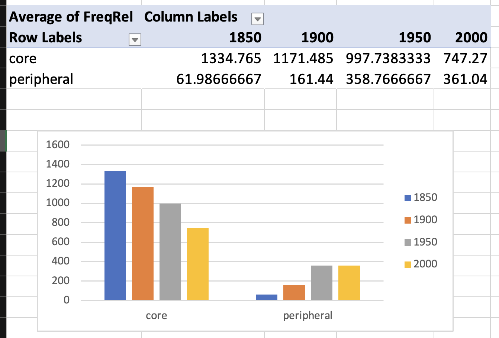
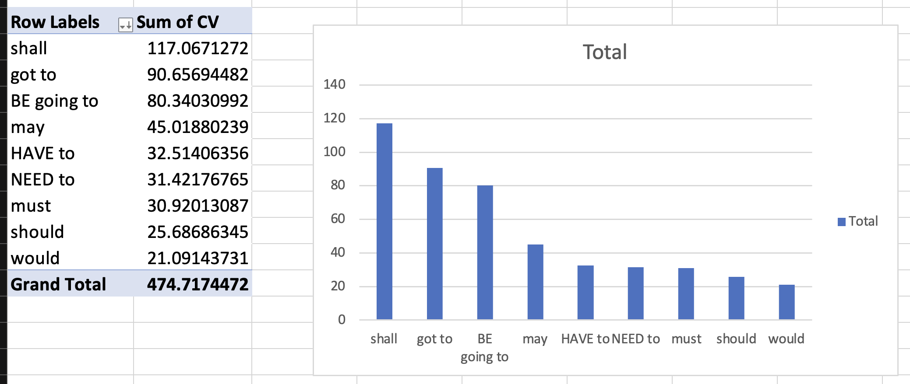

- {{embed ((64917fe0-a4ce-4950-b143-095414e022e3))}}
- {{embed ((64917fe7-8500-4261-99bc-f50ff0d481d4))}}
- # Language change among modal verbs ([[Hilpert2015Grammatical]])
  id:: 649aaeb1-7849-422b-9d30-8860afb2566d
	- ## theory
	  collapsed:: true
		- ((649abd0a-2934-4eca-96f8-8ff4f85e03e3))
		- Modal verbs in English
		  id:: 649ac78b-2cb0-4686-9390-52cd05c08ecf
			- core modal verbs
				- will
				- would
				- can
				- could
				- may
				- might
				- shall
				- should
				- must
			- peripheral modal verbs
				- BE going to
				- have to
				- got to
				- need to
		- modals with changes in frequency over time
			- ((649abd74-682e-4c07-b388-6ccbafd6fb97))
			- ((649abd8e-4b68-46ff-8a69-b11f268aa2cf))
			- {{embed ((649abdca-12ca-4150-ae99-5b6edae8284f))}}
			- decreases ([source](((649b01d8-55ec-4a2b-9455-ac178224b327))))
				- would
				- may
				- should
				- must
				- shall
			- increases ([source](((649abe39-2aaf-438b-89e0-298a7e3eadcb))))
				- BE going to
				- have to
				- got to
				- need to
		- interaction between frequency changes and causes
			- ((649abda8-5bb7-4afb-a445-0a64c24a9b54))
		- potential cause: [[text type/variation]]
			- ((649abee4-15ed-4e99-854e-92a81a090ec8))
	- ## [[practice]]
	  collapsed:: true
		- collaborative [[Microsoft Excel]] spreadsheet: https://1drv.ms/x/s!AvkgNVl9yS6aoH3H5Epize61oTeZ
		- studying the rise and fall of modal verbs in the [[COHA]]
			- for each of the following modal verbs
			  collapsed:: true
				- {{embed ((649ac78b-2cb0-4686-9390-52cd05c08ecf))}}
			- determine their absolute and relative frequencies in the decades
			  collapsed:: true
				- 1850
				- 1900
				- 1950
				- 2000
				- 
			- create bar charts that show
			  collapsed:: true
				- whether these individual words show frequency changes over time
				  collapsed:: true
					- 
					  id:: 64b64be4-04fb-41d4-a2e8-6317d8ea9a3d
				- whether the groups of (1) core and (2) peripheral modal verbs show frequency changes on aggregate
				  collapsed:: true
					- 
		- Investigating whether those modals that exhibit the highest changes in frequency show (changes in) preferences for specific text types using the [[COCA]]
		  collapsed:: true
			- 
			- **[[Coefficient of Variation]] (CV)**
			  collapsed:: true
				- background
				  collapsed:: true
					- **Definition**: The coefficient of variation (CV) is a statistical measure that describes the relative variability of data. It is calculated as the ratio of the standard deviation to the mean, and is often expressed as a percentage. This measure is particularly useful when comparing the degree of variation from one data series to another, even if the means are drastically different from each other.
					- **Application**: In the context of corpus linguistics, the CV can be used to measure the variability of word frequencies across different texts or corpora.
					- **Mathematical Formula**
						- CV = (Standard Deviation / Mean)
						- $$ CV = \left( \frac{\sigma}{\mu} \right) $$
					- **Calculation in Excel**
						- 1. **Calculate the Mean**: Use the `AVERAGE` function in Excel to calculate the mean of your data. If your data is in cells A1 to A10, you would type `=AVERAGE(A1:A10)` in a new cell.
						- 2. **Calculate the Standard Deviation**: Use the `STDEV.P` function (for a whole population) or the `STDEV.S` function (for a sample) in Excel to calculate the standard deviation. If your data is in cells A1 to A10, you would type `=STDEV.P(A1:A10)` or `=STDEV.S(A1:A10)` in a new cell.
						- 3. **Calculate the Coefficient of Variation**: Divide the standard deviation by the mean and multiply by 100 to get the coefficient of variation. If your mean is in cell B1 and your standard deviation is in cell B2, you would type `=(B2/B1)*100` in a new cell.
				- differences between individual modal verbs
				  collapsed:: true
					- 
					  id:: 64b64be4-e5a6-4ddf-9483-3cc5b0e458f5
				- differences between the two groups of core and peripheral modal verbs
				  collapsed:: true
					- 
			-
- further reading
  collapsed:: true
	- case studies on how to use corpus linguistics to study language change
		- [[Biber2015Cambridge]]
		- [[Stefanowitsch2020Corpus]]