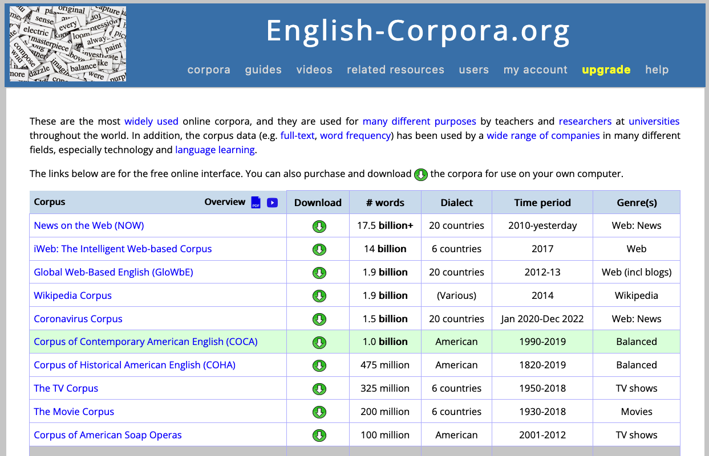
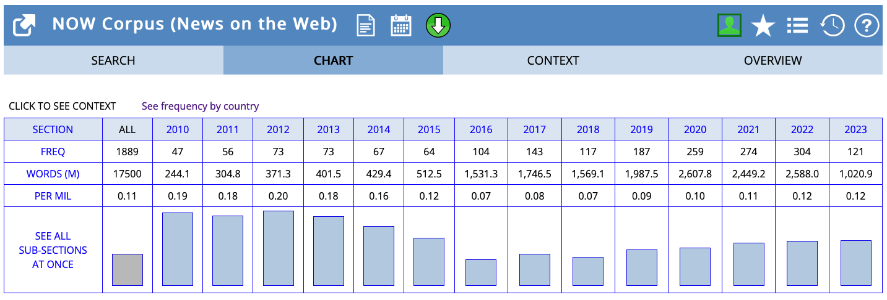
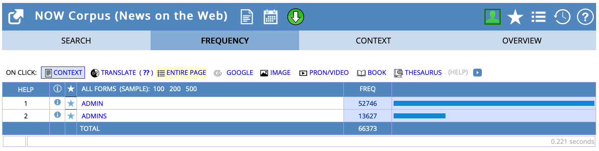
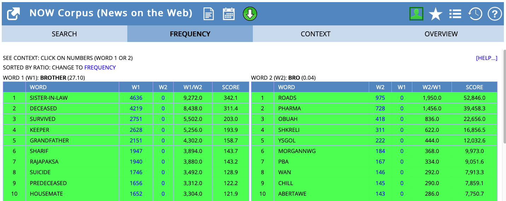

- how to use [[english-corpora.org]]
  id:: 64917fe0-a4ce-4950-b143-095414e022e3
	- overview of corpora
	  collapsed:: true
		- 
	- views
	  collapsed:: true
		- list view
		  collapsed:: true
			- ((649186ec-905d-4796-8eff-033adada0dbe))
		- chart view
		  collapsed:: true
			- query `decaf` in the [[NOW corpus]]
			  collapsed:: true
				- 
	- query syntax
	  collapsed:: true
		- lexemes
		  collapsed:: true
			- query`ADMIN` in the [[NOW corpus]]
			  collapsed:: true
				- 
		- wildcards
		  collapsed:: true
			- query `admin*` in the [[NOW corpus]] (list view)
			  collapsed:: true
				- 
				  id:: 649186ec-905d-4796-8eff-033adada0dbe
				  collapsed:: true
		- word classes
		  collapsed:: true
			- 
			- query `run_nn` in the [[NOW corpus]]
			  collapsed:: true
				- 
			- query `run_vv` in the [[NOW corpus]]
			  collapsed:: true
				- 
	- [[collocations]]
	  collapsed:: true
		- 
		- 
- [[language change]] in the use of [[modal verbs]] ([[Hilpert2015Grammatical]])
	- theory
		- ((649abd0a-2934-4eca-96f8-8ff4f85e03e3))
		- modal verbs in English
		  collapsed:: true
			- core modal verbs
			  collapsed:: true
				- will
				- would
				- can
				- could
				- may
				- might
				- shall
				- should
				- must
			- peripheral modal verbs
			  collapsed:: true
				- BE going to
				- have to
				- got to
				- need to
		- modals with changes in frequency over time
		  collapsed:: true
			- ((649abd74-682e-4c07-b388-6ccbafd6fb97))
			- ((649abd8e-4b68-46ff-8a69-b11f268aa2cf))
			- {{embed ((649abdca-12ca-4150-ae99-5b6edae8284f))}}
			- decreases ([source](((649b01d8-55ec-4a2b-9455-ac178224b327))))
			  collapsed:: true
				- *would*
				- *may*
				- *should*
				- *must*
				- *shall*
			- increases ([source](((649abe39-2aaf-438b-89e0-298a7e3eadcb))))
			  collapsed:: true
				- *BE going to*
				- *have to*
				- *got to*
				- *need to*
		- interaction between frequency changes and causes
		  collapsed:: true
			- ((649abda8-5bb7-4afb-a445-0a64c24a9b54))
		- potential cause: [[text type/variation]]
		  collapsed:: true
			- ((649abee4-15ed-4e99-854e-92a81a090ec8))
	- [[practice]]
		- studying the rise and fall of modal verbs in the [[COHA]]
		  collapsed:: true
			- for each of the following modal verbs
			  collapsed:: true
				- Modal verbs in English
			- determine their absolute and relative frequencies in the decades
			  collapsed:: true
				- 1850
				- 1900
				- 1950
				- 2000
				- 
			- create bar charts that show
			  collapsed:: true
				- whether these individual words show frequency changes over time
				  collapsed:: true
					- 
				- whether the groups of (1) core and (2) peripheral modal verbs show frequency changes on aggregate
				  collapsed:: true
					- 
		- investigating whether those modals that exhibit the highest changes in frequency show (changes in) preferences for specific text types using the [[COCA]]
		  collapsed:: true
			- on [[english-corpora.org]], query for modals followed by a verb
			  collapsed:: true
				- core modals: e.g. `NEED to *_vv`
				- peripheral modals: e.g. `BE going to *_vv`
			- store and analyse data in [[Microsoft Excel]]: https://1drv.ms/x/s!AvkgNVl9yS6aoH3H5Epize61oTeZ
			  collapsed:: true
				- data format
				  collapsed:: true
					- 
				- determine degree of text type variation based on the [[Coefficient of Variation]] (CV)
				  collapsed:: true
					- background
					  collapsed:: true
						- **Definition**: The coefficient of variation (CV) is a statistical measure that describes the relative variability of data. It is calculated as the ratio of the standard deviation to the mean, and is often expressed as a percentage. This measure is particularly useful when comparing the degree of variation from one data series to another, even if the means are drastically different from each other.
						- **Mathematical Formula**
						  collapsed:: true
							- CV = (Standard Deviation / Mean)
							- $$ CV = \left( \frac{\sigma}{\mu} \right) $$
						- **Calculation in Excel**
						  collapsed:: true
							- 1. **Calculate the Mean**: Use the `AVERAGE` function in Excel to calculate the mean of your data. If your data is in cells A1 to A10, you would type `=AVERAGE(A1:A10)` in a new cell.
							- 2. **Calculate the Standard Deviation**: Use the `STDEV.P` function (for a whole population) or the `STDEV.S` function (for a sample) in Excel to calculate the standard deviation. If your data is in cells A1 to A10, you would type `=STDEV.P(A1:A10)` or `=STDEV.S(A1:A10)` in a new cell.
							- 3. **Calculate the Coefficient of Variation**: Divide the standard deviation by the mean and multiply by 100 to get the coefficient of variation. If your mean is in cell B1 and your standard deviation is in cell B2, you would type `=(B2/B1)*100` in a new cell.
					- differences between individual modal verbs
					  collapsed:: true
						- 
					- differences between the two groups of core and peripheral modal verbs
					  collapsed:: true
						- 