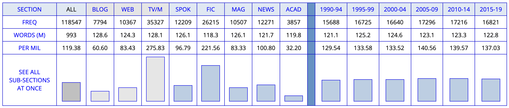
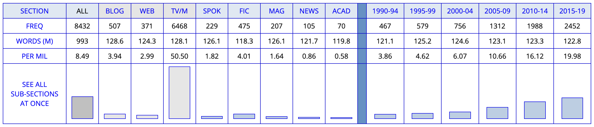

- language change in the use of modal verbs
	- {{embed ((6686b064-97a5-406d-ab3e-56a861cf0097))}}
- [[lexical innovation]] and [[language change]] in the use of [[clippings]] (→ [[Hilpert2023Meaning]])
  id:: 64917fe7-8500-4261-99bc-f50ff0d481d4
	- background
		- approach
			- ((646c7ffd-bf32-4ce5-9756-917cc35793c1))
			- ((646c7ffd-64bb-4d36-b9eb-e4f2494ab615))
			- ((646c7ffd-caf2-4a96-b8e4-16eedf3cecfd))
			- ((646c7ffd-bfe5-4944-b360-056be5d512c8))
		- corpus data
			- ((645a2859-a8d9-42e6-a102-69fd03ed164e))
		- dataset of blends
			- {{embed ((646c7ffd-9ec6-4e8d-a179-d516891af48f))}}
		- [[text type/variation]]
			- ((645a1dbd-328b-464e-b703-0ef2c6ab114f))
			- ((646c7ffd-a38c-4a5b-8f4f-174115b0de8d))
			- analysis using [[COCA]]
				- for *brother*
					- 
				- for *bro*
					- 
	- [[practice]]: group projects using [[english-corpora.org]] ([[NOW corpus]])
		- collaborative [[Microsoft Powerpoint]] file: https://1drv.ms/p/s!AvkgNVl9yS6aok8lTi12bVy5q2YG
- further reading
	- case studies on how to use corpus linguistics to study language change
		- [[Biber2015Cambridge]]
		- [[Stefanowitsch2020Corpus]]