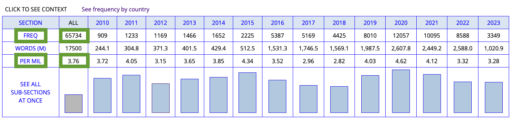
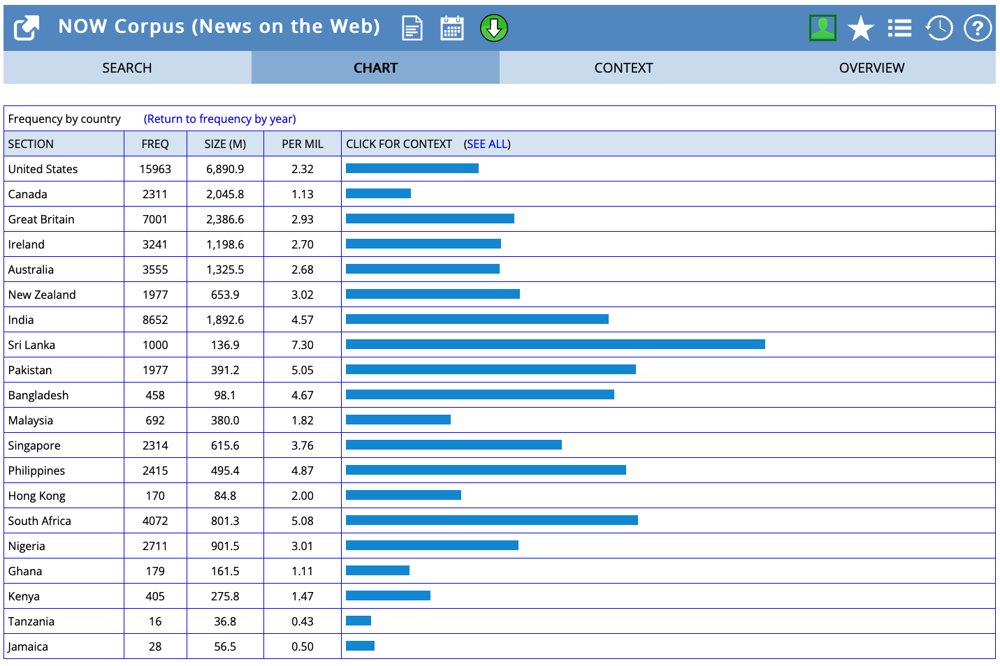

- {{embed ((64917fe0-a4ce-4950-b143-095414e022e3))}}
- {{embed ((64917fe7-8500-4261-99bc-f50ff0d481d4))}}
- [[lexical innovation]] and [[language change]] in the use of [[clippings]] (→ [[Hilpert2023Meaning]])
  id:: 64917fe7-8500-4261-99bc-f50ff0d481d4
  collapsed:: true
	- theoretical background
	  collapsed:: true
		- ((646c7ffd-bf32-4ce5-9756-917cc35793c1))
		- ((646c7ffd-64bb-4d36-b9eb-e4f2494ab615))
		- ((646c7ffd-caf2-4a96-b8e4-16eedf3cecfd))
		- ((646c7ffd-bfe5-4944-b360-056be5d512c8))
	- corpus data
	  collapsed:: true
		- ((645a2859-a8d9-42e6-a102-69fd03ed164e))
	- dataset of blends
	  collapsed:: true
		- {{embed ((646c7ffd-9ec6-4e8d-a179-d516891af48f))}}
	- [[text type/variation]]
		- ((645a1dbd-328b-464e-b703-0ef2c6ab114f))
		- ((646c7ffd-a38c-4a5b-8f4f-174115b0de8d))
		- analysis using [[COCA]]
			- for *brother*
				- 
			- for *bro*
				- 
	- [[practice]] using [[english-corpora.org]] ([[NOW corpus]])
		- gather your results in this cloud-based [[Microsoft Excel]] sheet: https://1drv.ms/x/s!AvkgNVl9yS6aoHF5zsqY2kmwifHf
		  id:: 64918cff-725a-4b4d-bb07-f8464faa4bd4
		- [[frequency]] analysis
			- [[diachronic]] frequency: sheet `FreqDiac`
				- How often were the source and clipped forms used in 2010 and 2020?
					- hint: use lemmatised searches (e.g. `ADMIN` and `ADMINISTRATION`)
					- 
						- [[frequency/absolute]]: `FREQ`
						- [[frequency/relative]]: `PER MIL`
			- [[geographical variation]]: Are clipped forms used more frequently in the US or GB?
				- gather data in the sheet `FreqGeo`
				- for all clipped forms, get the frequency information for `United States` and `Great Britain` using the `See frequency by country` button in the chart view
					- 
					  id:: 64b64be4-1e12-4771-9746-a60eab859682
				-
- further reading
	- case studies on how to use corpus linguistics to study language change
		- [[Biber2015Cambridge]]
		- [[Stefanowitsch2020Corpus]]