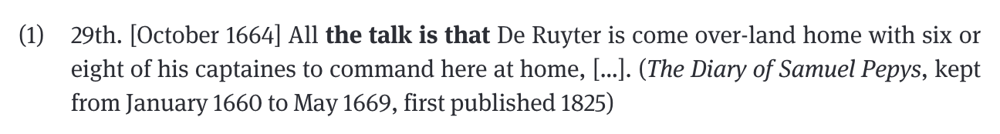
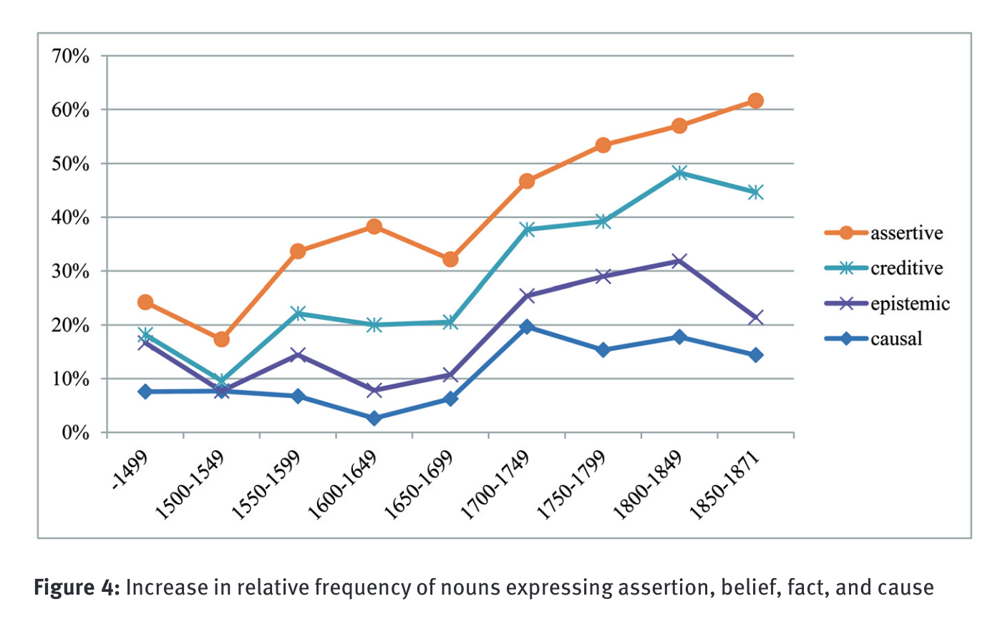

- [[bibliography]]
	- Schmid, Hans-Jörg, and Annette Mantlik. 2015. ‘Entrenchment in Historical Corpora? Reconstructing Dead Authors’ Minds from Their Usage Profiles’. *Anglia (Halle an Der Saale, Germany)* 133 (4): 583—623.
	  id:: 64b64be5-0fd4-435b-962e-93e50acf6806
- [[pdf]]: [Schmid2015EntrenchmentHistorical.pdf](../assets/Schmid2015EntrenchmentHistorical_1684829585604_0.pdf)
- [[abstract]] (Schmid and Mantlik, 2015, p. 583)
  id:: 661fc639-3d08-4e66-b532-c148f3dd1a98
	- “Data from eight historical corpora spanning the period between **1250 and 1871** are investigated with regard to occurrences of the ‘**N+BE+that-construction**’ (as in my concern is that [...], the idea was that [...]).
	  id:: 646c8707-eff6-415a-aeef-ecde49f26c76
	- The formal, semantic, and pragmatic changes of this construction are described on the basis of 1,588 attestations retrieved from the corpora.
	- Following this, the usage profiles of **individual authors** are examined. It is shown that even authors who are comparable in terms of period and genre show significant differences with regard to
		- the **frequency** of use of the construction,
		- **collocational** ranges and preferences,
		- the use of **semi-fixed lexical expressions** manifesting the construction,
		- as well as their **functional preferences**.
	- These differences are interpreted from the perspective of the so-called [‘ Entrenchment-and-Conventionalization Model’]([[EC-Model]]) (Schmid 2014a and 2015).
		- It is argued that the usage profiles of individual authors can provide insights into the ways in which the construction under investigation was represented in these authors’ minds,
		- and that the observable collective long-term changes arise from the interaction of the cognitive processes in individual minds and the social processes taking place in the speech community.”
- the construction: `the N BE that`
  id:: 646c88dc-74b3-4967-9c65-677007940e4d
	- examples
		- *my concern is that […]*
		- *the idea was that […]*
		- *the thing is that […]*
		- *the worries are that […]*
	- corpus attestation
		- {:height 80, :width 540}
		  id:: 646c88e8-8923-4244-8457-d4791a56e7a0
		  p. 586
	- analysis in terms of [[Construction Grammar]]
		- 
		  id:: 646c898a-23b1-46e0-82ea-39c4e1ca833e
		  (p. 586)
- [[EC-Model]]
  id:: 647f0619-8bfb-42b3-b4af-607eb44184b2
  collapsed:: true
	- 
	  collapsed:: true
		- p. 588
- [[data]]
  id:: 646c8878-fbbe-4f50-880c-b764b77f3330
	- 
	  id:: 646c887b-81fc-4b73-b8a9-5ace5e7b9ece
	  (p. 591)
- results
	- [[diachronic]] [[frequency]]
	  id:: 646c8a01-f035-4b66-8d80-df92ce4de28c
		- 
		  id:: 646c8a0c-c206-4b08-b7e3-30428f0f3596
		  (p. 601)
	- [[text type]] distribution
	  collapsed:: true
		- 
		  id:: 647f06ba-5e13-4ba5-924d-4f73fdc7655f
		  collapsed:: true
			- p. 600
	- [[speaker variation]]
		- 
		  id:: 647f0734-ac35-4b68-bf52-0cc558e7b4cc
		  collapsed:: true
			- p. 606
		- 
		  id:: 647f073d-ed74-4752-9930-0c3aedd92107
		  collapsed:: true
			- p. 607
	- 
	  id:: 64886ad2-420f-40e7-933e-06a9ab7469f8
	- [semantic change]([[semantic/change]])
	  id:: 646c9bdd-a595-46b1-a2c5-58d66fcb592b
		- {:height 375, :width 540}
		  (p. 597)
		- 
		  (p. 598)
		- 
		  id:: 64b64be5-52fd-4eb6-8a40-85d03b955b62
		  (p. 598)