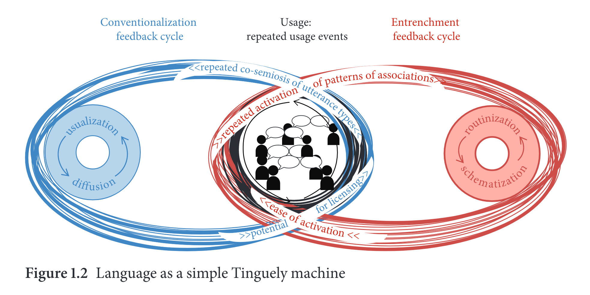

- [[bibliography]]
	- Schmid, Hans-Jörg. 2020. *The Dynamics of the Linguistic System. - Usage, Conventionalization, and Entrenchment*. Oxford: Oxford University Press.
- the interplay between [[usage]], [[entrenchment]], and [[conventionalization]]
  id:: 6447aec5-f6ed-4fc0-99e4-23a9d1ea761f
	- 
	  id:: 64b64be5-125d-4878-bff7-43b9cf505a92
	  (p. 4)